# 🌩️ Cloud & DevOps Mastery – Visual Architecture Learning System

<div align="center">


**Master Amazon EC2 from zero to production — with real-world system design, visual architecture, and SRE-grade thinking.**

</div>

---

## 🏆 Project Goal

This repository is your **complete EC2 engineering guide** — built for engineers who want to go beyond tutorials and understand how production cloud systems actually work. It combines visual architecture diagrams, real-world patterns, failure-handling mindsets, and step-by-step labs that mirror enterprise deployments.

Whether you are a beginner launching your first instance or a mid-level engineer preparing for cloud architecture interviews, this guide walks you from foundational concepts all the way to production-grade system design.

> 🎯 **Goal:** Learn EC2 like a senior cloud engineer — not like a student reading a manual.

---

## 📚 Table of Contents

- [🎬 Architecture Preview](#-architecture-preview)
- [🧠 What is Amazon EC2?](#-what-is-amazon-ec2)
- [🖥️ EC2 Instance Types](#%EF%B8%8F-ec2-instance-types)
- [💰 EC2 Pricing Models](#-ec2-pricing-models)
- [🚀 Launching Your First EC2 Instance](#-launching-your-first-ec2-instance)
- [🔐 Key Pairs & Secure Access](#-key-pairs--secure-access)
- [🖼️ AMI – Amazon Machine Image](#%EF%B8%8F-ami--amazon-machine-image)
- [📦 Placement Groups](#-placement-groups)
- [⚡ User Data – Bootstrap Automation](#-user-data--bootstrap-automation)
- [🔎 EC2 Instance Metadata](#-ec2-instance-metadata)
- [🛠️ EC2 Access Recovery Methods](#%EF%B8%8F-ec2-access-recovery-methods)
- [🧩 Multi-Layer System Design](#-multi-layer-system-design)
- [📐 Architecture Diagrams](#-architecture-diagrams)
- [⚙️ Configuration Reference](#%EF%B8%8F-configuration-reference)
- [🔐 Security Best Practices Checklist](#-security-best-practices-checklist)
- [🧰 Interactive Tools](#-interactive-tools)
- [🤝 Contributing](#-contributing)
- [📜 License](#-license)

---

## 🎬 Architecture Preview

> 📸 Visual-first learning. Every major section has an accompanying diagram or screenshot placeholder. Drop your real screenshots into `docs/images/` and they will slot right in.

```
docs/
├── images/
│   ├── demo.gif                          ← Full EC2 workflow animation
│   ├── architecture.png                  ← High-level EC2 system architecture
│   ├── ec2-launch-step1.png              ← Console: Launch wizard start
│   ├── ec2-launch-step2.png              ← Console: AMI + instance type selection
│   ├── ec2-launch-step3.png              ← Console: Security group configuration
│   ├── ami-create-step1.png              ← Console: Create image action
│   ├── ami-create-step2.png              ← Console: Image name + volume config
│   ├── ami-launch-step1.png              ← Console: Launch from AMI
│   ├── placement-group-diagram.png       ← Visual of 3 placement strategies
│   ├── userdata-console-step1.png        ← Advanced Details → User Data field
│   ├── metadata-curl-output.png          ← Terminal: metadata curl response
│   ├── keypair-auth-flow.png             ← SSH key pair challenge-response flow
│   ├── spot-interruption-handling.png    ← Spot instance 2-min notice handling
│   ├── failure-recovery-flow.png         ← ASG auto-recovery chain
│   └── animated-architecture.gif         ← End-to-end request lifecycle animation
assets/
├── animations/
│   ├── request_flow.gif
│   ├── system_interaction.mp4
│   ├── failure_recovery.gif
│   └── scaling_behavior.gif
```


---

## 🧠 What is Amazon EC2?

📌 **Definition:** Amazon EC2 (Elastic Compute Cloud) is a web service that provides **on-demand, resizable virtual servers** — called **instances** — in the cloud. You rent compute power, pay only for what you use, and never touch physical hardware.

💡 **Real-World Explanation:**

Before cloud, if a startup needed 10 servers, they had to:
- Purchase physical machines (weeks of lead time, huge upfront cost)
- Set them up in a data center (networking, cooling, power, cabling)
- Manage OS patches, hardware failures, capacity planning, and more
- Pay for it all whether traffic was low or high

With EC2, you replace all of that with an API call. In under 60 seconds you have a fully running virtual machine — with your choice of OS, CPU, RAM, disk, and network — billed by the second. When you no longer need it, you delete it and billing stops.

> 🏭 **Production analogy:** Netflix, Airbnb, NASA, and Pfizer all run workloads on EC2-style infrastructure. When user traffic doubles overnight, they scale horizontally — not by calling a hardware vendor. When traffic drops, they scale back and stop paying. This is the fundamental economics shift that cloud computing enabled.

---

### 🔍 How EC2 Works Under the Hood

When you launch an EC2 instance, here is what actually happens inside AWS infrastructure:

```
1. You call the RunInstances API (via Console, CLI, Terraform, or SDK)
2. AWS Placement Service selects a suitable physical host in your chosen AZ
3. The AWS Nitro Hypervisor carves out your virtual machine on that physical host
4. Your chosen AMI (disk image) is copied onto a new EBS volume
5. A virtual network interface is created and attached inside your VPC
6. Security Group rules are applied at the hypervisor level (before traffic reaches OS)
7. IAM role credentials are placed in the instance metadata service
8. Your User Data script is passed to cloud-init for automatic first-boot execution
9. The instance boots, cloud-init runs, and the instance becomes reachable
```

> 💡 **About the AWS Nitro System:** Nitro is AWS's custom-built hypervisor and dedicated security chip. It offloads virtualisation, networking (ENA), and storage (NVMe) to dedicated hardware — completely separate from the instance's CPU. This is why EC2 instances deliver near-bare-metal performance. You are not sharing CPU cycles with noisy neighbours or losing compute to hypervisor overhead.

---

### ✅ Key Benefits

| Benefit | What It Means in Production |
|---|---|
| ⚡ **Elasticity** | Auto-scale up during Black Friday, scale down overnight — automatically, no human needed |
| 💵 **Pay-as-you-go** | Billed per second (min 60s). Stop the instance and billing stops immediately |
| 🔧 **Full Control** | Root access to OS, custom kernel modules, full networking control, storage layout |
| 🚀 **Speed** | New server in ~60 seconds vs. 4–6 weeks for physical hardware procurement |
| 🌍 **Global Reach** | Deploy in 30+ regions, 90+ Availability Zones worldwide for low-latency access |
| 🔒 **Security** | VPC network isolation, Security Groups (stateful firewall), IAM, encryption everywhere |
| 🎛️ **1,000+ Instance Types** | Pick the exact CPU/RAM/GPU/storage profile your workload actually needs |
| 🔄 **Deep Integration** | Native integration with 200+ AWS services — S3, RDS, Lambda, CloudWatch, and more |

---

### 🏗️ High-Level EC2 Architecture

This is the bird's-eye view of how EC2 fits into a typical production system. Every arrow represents a network hop that you control through VPC routing, Security Groups, and IAM.

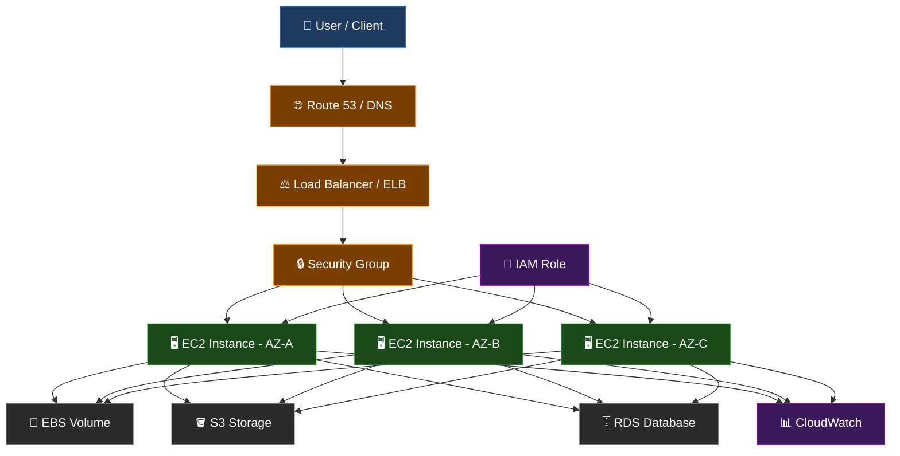

> 📸 `docs/images/architecture.png`

**Reading this diagram:**
- **Blue (User Layer):** Where requests originate — browser, mobile app, or API client
- **Orange (Edge Layer):** Traffic entry points — DNS for routing, load balancer for distribution, Security Group as firewall
- **Green (App Layer):** Your EC2 instances running actual application logic, spread across 3 Availability Zones for fault tolerance
- **Gray (Data Layer):** Persistent storage — EBS (block storage), S3 (object storage), RDS (managed relational database)
- **Purple (Service Layer):** IAM controls what the EC2 can access in AWS; CloudWatch observes and alerts on everything

---

## 🖥️ EC2 Instance Types

📌 **Definition:** Instance types define the **hardware profile** of your virtual machine — vCPU count, RAM, network throughput, and storage IOPS. AWS organises them into families based on their primary optimisation target.

💡 **Why this matters:** Choosing the wrong instance type is one of the most common and expensive cloud mistakes. Running a memory-hungry in-memory database on a compute-optimised instance wastes money and hurts performance. Running a CPU-bound batch job on a memory-optimised instance overpays for unused RAM.

The discipline is: **identify your workload's dominant bottleneck first, then match the instance family.**

---

### 📊 Instance Family Cheatsheet

| Family | Prefix Letters | Primary Strength | Real-World Use Cases |
|---|---|---|---|
| **General Purpose** | T, M, A | Balanced CPU + RAM | Web servers, dev/test environments, small databases, microservices APIs |
| **Compute Optimised** | C | High-performance CPU | Batch processing, video encoding/transcoding, ML inference, gaming servers, HPC |
| **Memory Optimised** | R, X, Z | Large RAM, fast memory access | Redis, Memcached, SAP HANA, in-memory analytics, real-time bidding systems |
| **Storage Optimised** | I, D, H | High sequential IOPS and throughput | Kafka, Elasticsearch, data warehouses, Hadoop HDFS, NoSQL like Cassandra |
| **Accelerated Computing** | P, G, F, Inf | GPU / FPGA hardware accelerators | Deep learning training, computer vision, 3D rendering, genomic sequencing |
| **HPC Optimised** | Hpc | Ultra-fast EFA networking | Computational fluid dynamics, weather simulation, financial modelling |

---

### 🔤 Decoding an Instance Type Name

AWS instance type names follow a consistent naming convention. Once you understand the pattern, you can decode any instance type at a glance without memorising lists.

```
  c   7   g   n   .   48   x   l   a   r   g   e
  │   │   │   │       │    │
  │   │   │   │       │    └── Size modifier: x = extra, n = NVMe SSD
  │   │   │   │       └─────── vCPU tier: 48xlarge = 192 vCPUs
  │   │   │   └─────────────── Attribute: n = enhanced network bandwidth
  │   │   └─────────────────── Processor: g = AWS Graviton (ARM64)
  │   │                                    d = local NVMe SSD attached
  │   │                                    a = AMD EPYC processor
  │   │                                    i = Intel processor
  │   └─────────────────────── Generation: 7 = 7th generation
  │                             Higher = newer chips, better price-performance ratio
  └─────────────────────────── Family: c = Compute Optimised
```

**Size progression** (smallest to largest, roughly doubling CPU/RAM each step):
```
nano → micro → small → medium → large → xlarge → 2xlarge → 4xlarge → 8xlarge → 16xlarge → 32xlarge → 48xlarge → metal
```

> 💡 **Always prefer the latest generation:** `m7g` over `m5`. `c7g` over `c5`. Latest generation instances give you 20–40% better performance at the same or lower price because AWS has improved the underlying processor and Nitro infrastructure.

---

### 🏷️ Key Instance Families — Detailed Explanation

**T-series (T3, T4g) — Burstable General Purpose:**
These use a CPU credit system. The instance runs at a low baseline CPU utilisation (e.g., 20%) and earns CPU credits over time. When your workload spikes, it burns credits to burst to 100% CPU. Perfect for workloads with intermittent CPU spikes: web servers, dev/test boxes, CI agents, small APIs. The `t3.micro` is Free Tier eligible and the most common starting point. Be careful — if credits run out under sustained load, performance drops sharply to baseline.

**M-series (M7g, M6i) — Standard General Purpose:**
The workhorse family. Delivers consistent, non-burstable CPU performance at all times. No credit system, no throttling. Use these for application servers that need reliable sustained compute — REST APIs, background workers, mid-size databases, caching layers.

**R-series (R7g, R6i) — Memory Optimised:**
Higher RAM-to-CPU ratio vs the M-series. An `r6i.2xlarge` gives 8 vCPUs with 64 GB RAM vs 32 GB on `m6i.2xlarge` — double the RAM for the same CPU at a similar price. Use for Redis, Memcached, large JVM heap applications, in-memory analytics, SAP HANA, or any workload that is RAM-limited before CPU-limited.

**C-series (C7g, C6i) — Compute Optimised:**
Higher CPU-to-RAM ratio — gives you more compute for the same price vs M-series. Use for CPU-bound batch jobs, video transcoding, scientific simulations, ML model inference (not training), high-frequency trading engines, DNS servers, or game servers.

---

### ⚙️ Instance Selection Decision Flow

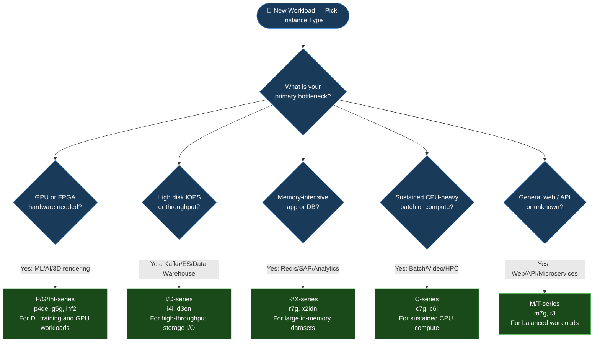

> 📸 `docs/images/instance-type-decision-tree.png`

---

## 💰 EC2 Pricing Models

📌 **Definition:** EC2 offers **five distinct pricing models** — each optimised for a different combination of workload predictability, flexibility need, and cost tolerance. Picking the wrong one is one of the most common sources of avoidable cloud waste.

💡 **The core trade-off:** The more commitment you give AWS (in time or money), the more discount you receive. The more flexibility and zero commitment you need, the more you pay per hour. Understanding this spectrum is fundamental to cloud cost engineering.

---

### 💡 Pricing Model Comparison

| Model | Discount vs On-Demand | Commitment | Interruption Risk | Best For |
|---|---|---|---|---|
| **On-Demand** | Baseline — no discount | None | ❌ Never interrupted | Dev/test, unpredictable traffic, new workloads being profiled |
| **Savings Plans** | Up to 66–72% | 1 or 3 years | ❌ Never interrupted | Flexible baseline compute across instance families and regions |
| **Reserved Instances** | Up to 75% | 1 or 3 years | ❌ Never interrupted | Steady-state apps — databases, always-on services, known capacity |
| **Spot Instances** | Up to 90% | None | ✅ Yes — 2-min notice | Fault-tolerant batch jobs, ML training, big data, stateless workers |
| **Dedicated Hosts** | Fixed pricing | On-demand or reserved | ❌ Never interrupted | BYOL licensing, PCI/HIPAA compliance, physical isolation needs |

---

### 🔎 Each Pricing Model — Explained in Depth

**On-Demand:**
Pay for every second the instance is running. Minimum 60 seconds. When you stop the instance, billing stops entirely. This is the default, most flexible, and most expensive-per-hour option. Use it when you do not yet know your workload pattern, for short-lived jobs, or for development and testing where you want to start and stop freely.

**Savings Plans:**
You commit to spending a fixed dollar amount per hour (e.g., $0.50/hr) for 1 or 3 years. AWS applies a discount on all your compute usage up to that commitment — regardless of instance family, size, OS, or region. Two variants:
- *Compute Savings Plans:* Most flexible — discount applies to EC2, Fargate, and Lambda automatically
- *EC2 Instance Savings Plans:* Highest discount, but locked to a specific instance family and region

**Reserved Instances (RIs):**
You reserve specific capacity for 1 or 3 years and get a significant discount. Payment options: All-Upfront (max discount), Partial-Upfront, or No-Upfront. Two types:
- *Standard RIs:* Fixed to a specific instance family, OS, and region — maximum 75% discount
- *Convertible RIs:* You can exchange them for different family/OS/region — lower discount but more flexibility if workload changes

**Spot Instances:**
You bid on spare, unused EC2 capacity in a specific AZ. AWS can reclaim your instance with a **2-minute advance warning** when they need the capacity back. Prices fluctuate based on supply and demand — typically 70–90% below On-Demand. This is transformative for cost if your workload can handle interruption: save state to SQS/S3, checkpoint progress, and resume on a new Spot instance.

**Dedicated Hosts:**
You get a full physical server allocated exclusively to your account. No other customer's instances run on it. Required when enterprise software licenses are tied to physical cores or sockets (Oracle DB, Windows Server BYOL), or when regulations mandate physical tenant isolation.

---

### 🔥 Spot Instance SRE Pattern — Handling Interruptions

> ⚠️ Spot instances **can be reclaimed by AWS** with a 2-minute warning. This is not a bug — it is a design constraint. Design your workloads to survive it and unlock 90% cost savings.

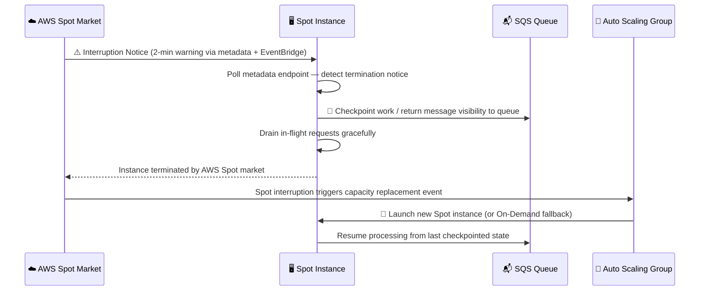

> 📸 `docs/images/spot-interruption-handling.png`

**Detecting the interruption notice inside your instance:**
```bash
# Poll this endpoint every 5 seconds inside your application
TOKEN=$(curl -s -X PUT "http://169.254.169.254/latest/api/token" \
  -H "X-aws-ec2-metadata-token-ttl-seconds: 30")

curl -s -H "X-aws-ec2-metadata-token: $TOKEN" \
  http://169.254.169.254/latest/meta-data/spot/instance-action

# When interruption is imminent, this returns:
# {"action": "terminate", "time": "2026-04-09T14:32:00Z"}
# You have until that timestamp to checkpoint and exit cleanly
# Silence / 404 means no interruption is pending
```

---

### 📐 Cost Optimisation Decision Flow

```mermaid
flowchart TD
    classDef q fill:#1a3a5a,stroke:#4a90d9,color:#fff
    classDef a fill:#1a4a1a,stroke:#4caf50,color:#fff
    classDef warn fill:#4a2000,stroke:#ff9900,color:#fff

    Q1{Is workload predictable\nand always-on?}:::q
    Q1 -- Yes --> Q2{Need flexibility across\nfamilies or regions?}:::q
    Q2 -- Yes --> SP[✅ Savings Plans\nCompute or EC2 variant]:::a
    Q2 -- No --> RI[✅ Reserved Instances\nStandard — highest discount]:::a
    Q1 -- No --> Q3{Can it tolerate\ninterruption?}:::q
    Q3 -- Yes --> SPOT[✅ Spot Instances\nUp to 90% savings]:::a
    Q3 -- No --> OD[✅ On-Demand\nFull flexibility, full price]:::a
    OD --> TIP[💡 Tag and profile 30 days\nthen revisit with real data]:::warn
    SPOT --> MIX[💡 Mix Spot + On-Demand\nin ASG for resilience\n(80% Spot / 20% On-Demand)]:::warn
```

---

## 🚀 Launching Your First EC2 Instance

📌 **Definition:** Provisioning an EC2 instance means creating a virtual machine in a specific AWS Region and Availability Zone, with a chosen OS image, compute hardware profile, network placement, storage configuration, and access controls.

💡 **What you are actually doing:** You are telling AWS — "give me a virtual machine with this OS, on this hardware, inside this network, protected by this firewall, accessible with this key." AWS assembles all those pieces across its physical infrastructure and boots your machine in under 60 seconds.

---

### ⚙️ Step-by-Step Launch Workflow

```
STEP 1 → Open AWS Console → Search "EC2" in the top bar → Click "Launch Instance"

STEP 2 → Name your instance (e.g., "prod-web-01")
          This creates a Name tag automatically
          Use a consistent naming convention: {env}-{tier}-{number}
          Examples: prod-web-01, staging-api-02, dev-bastion-01

STEP 3 → Select an AMI (Operating System image)
          ✅ Amazon Linux 2023  — recommended for new production workloads
                                  AWS-maintained, free security patches, optimised for EC2
          ✅ Ubuntu 22.04 LTS  — preferred if your team uses Debian-based tooling
          ✅ Windows Server     — required for .NET workloads or Active Directory
          ✅ Custom AMI         — your own Golden AMI for consistent deployments

STEP 4 → Choose Instance Type
          ▸ t3.micro    → Free Tier eligible, good for learning and dev only
          ▸ t3.small    → Small web apps, light background workers
          ▸ m7g.large   → Production general-purpose workloads, APIs, app servers
          ▸ c7g.xlarge  → CPU-bound workloads, batch processing
          ▸ r7g.large   → Memory-heavy apps, Redis, analytics

STEP 5 → Create or select a Key Pair (.pem file)
          Click "Create new key pair" if you don't have one
          ⚠️ DOWNLOAD THE .PEM FILE IMMEDIATELY — AWS will NOT let you re-download it ever again
          Save it to ~/.ssh/ and set permissions: chmod 400 mykeypair.pem

STEP 6 → Configure Network Settings
          ▸ VPC: Select your custom VPC (never use the default VPC in production)
          ▸ Subnet: Choose private subnet for app/DB tiers
                    Choose public subnet ONLY for load balancers, bastions, NAT gateways
          ▸ Auto-assign Public IP: Enable only if the instance needs direct internet access

STEP 7 → Configure Security Group (your virtual firewall)
          Create a new group with specific rules:
          ▸ SSH  port 22  → Source: YOUR IP /32 ONLY — never 0.0.0.0/0 in production
          ▸ HTTP port 80  → Source: 0.0.0.0/0 for public web servers
          ▸ HTTPS port 443 → Source: 0.0.0.0/0 for public web servers
          ▸ App port (e.g., 8080) → Source: Load Balancer Security Group ID only
          ▸ DB port (e.g., 5432) → Source: App tier Security Group ID only

STEP 8 → Configure Storage (EBS volumes)
          ▸ Volume Type: gp3 (default) — best price-performance ratio
                         gp2 is legacy — prefer gp3 for all new volumes
                         io2 — for high-IOPS database workloads
          ▸ Volume Size: 20 GB minimum for OS + app files
                         Scale up based on log retention and data needs
          ▸ Encryption: ALWAYS enable in production
          ▸ Delete on Termination: Enable for ephemeral app servers
                                   DISABLE for data servers with valuable data

STEP 9 → Add Tags — Critical for production cost management
          ▸ Name        = prod-web-01
          ▸ Environment = production
          ▸ Team        = platform-engineering
          ▸ Service     = api-backend
          ▸ CostCenter  = eng-001
          Without tags, AWS Cost Explorer cannot show you what is spending what

STEP 10 → Advanced Details → Paste your User Data bootstrap script (optional)
           This script runs automatically on first boot

STEP 11 → Review the summary panel → Click "Launch Instance"
           Instance enters "pending" state → transitions to "running" in 30–60 seconds
           Find it under EC2 → Instances → filter by your instance name
```

> 📸 `docs/images/ec2-launch-step1.png` — Launch wizard: name and AMI selection
> 📸 `docs/images/ec2-launch-step2.png` — Instance type and key pair selection
> 📸 `docs/images/ec2-launch-step3.png` — Network, security group, and storage configuration

---

### 🔌 Connecting After Launch (SSH)

Once the instance shows "Running" status with a green checkmark, you can connect:

```bash
# ─────────────────────────────────────────────────────
# BEFORE CONNECTING: Fix .pem file permissions
# SSH refuses to use a key file readable by other users
# This is enforced by SSH, not optional
# ─────────────────────────────────────────────────────
chmod 400 mykeypair.pem       # Read-only for you, no access for group/world

# ─────────────────────────────────────────────────────
# CONNECT via SSH
# ─────────────────────────────────────────────────────
ssh -i "mykeypair.pem" ec2-user@<Public-IP-or-Public-DNS>

# The DNS format looks like:
# ec2-54-123-45-67.compute-1.amazonaws.com
# This is equivalent to using the IP directly

# ─────────────────────────────────────────────────────
# DEFAULT SSH USERNAME per AMI type
# ─────────────────────────────────────────────────────
# Amazon Linux 2 / AL2023   → ec2-user
# Ubuntu                    → ubuntu
# Debian                    → admin
# CentOS / RHEL              → ec2-user  or  centos
# SUSE Linux Enterprise      → ec2-user  or  root
# Windows Server            → Administrator  (use RDP on port 3389)
```

> 💡 **Troubleshooting common SSH errors:**
> - `Permission denied (publickey)` → Wrong username for your AMI, wrong .pem file, or SG blocking port 22
> - `Connection timed out` → Security Group doesn't allow your current IP on port 22
> - `UNPROTECTED PRIVATE KEY FILE! WARNING` → Run `chmod 400 mykey.pem` first — SSH refuses unsafe keys
> - `Host key verification failed` → Delete the stale entry: `ssh-keygen -R <instance-ip>`
> - `ssh: connect to host port 22: Connection refused` → Instance is still booting, wait 30s and retry

---

### 🔒 Security Group — Core Concepts

A **Security Group** acts as a **stateful virtual firewall** at the instance level. Unlike traditional firewalls that apply rules independently per direction, Security Groups automatically allow return traffic for any permitted outbound/inbound connection — you never write a separate "allow return traffic" rule.

**Key principles to understand:**

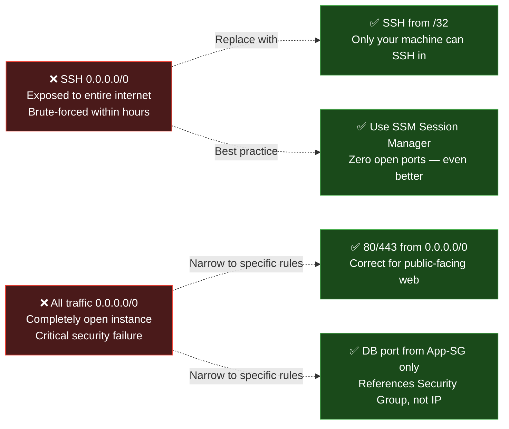

> 📸 `docs/images/security-group-config.png`

---

## 🔐 Key Pairs & Secure Access

📌 **Definition:** A Key Pair is an **asymmetric cryptographic credential** (public + private key) used to authenticate SSH access to your EC2 instance without a password. AWS stores the public key inside your instance; you keep the private key file (`.pem`) on your local machine.

💡 **Why no password?** Passwords can be guessed, phished, intercepted, or brute-forced. A private key is a 2048-bit (or larger) mathematical proof of identity. Even if someone knows your exact username and IP address, they cannot log in without the matching private key. The cryptographic computation required to brute-force a 2048-bit RSA key would take longer than the age of the universe with current computing power.

---

### 🔑 How Key Pair Authentication Works — Step by Step

This is called **public-key cryptography** or **asymmetric authentication**. The private key never leaves your machine — only a cryptographic signature derived from it is transmitted. The server verifies the signature using the public key without ever needing to see the private key.

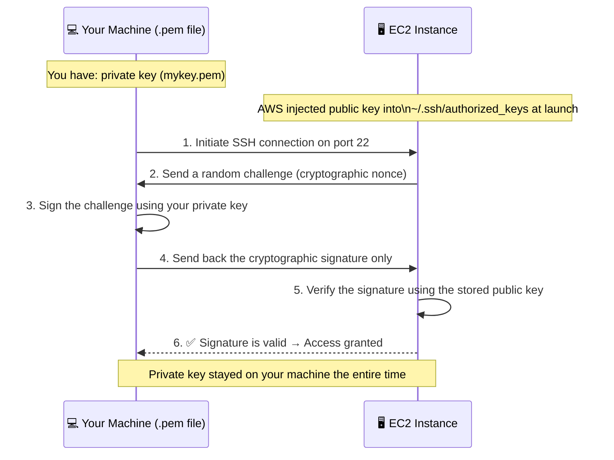

> 📸 `docs/images/keypair-auth-flow.png`

---

### 📋 Key Pair Algorithms

| Algorithm | Security | Speed | Compatibility | Recommended For |
|---|---|---|---|---|
| **RSA (2048-bit)** | Strong | Moderate | Universal — works with all SSH clients, PuTTY, WinSCP | Beginners, widest compatibility |
| **RSA (4096-bit)** | Very strong | Slightly slower | Universal | High-security environments |
| **ED25519** | Very strong (smaller key) | Faster than RSA | Modern SSH clients (OpenSSH 6.5+ / 2014+) | Advanced users, greenfield setups |

> 🌟 **Recommendation:** Choose **RSA** if you are starting out. It works with every SSH client on every platform — Linux, macOS, Windows PowerShell, PuTTY, VS Code Remote SSH, and more. ED25519 is mathematically superior but not supported in some legacy corporate VPN or SSH tools.

---

### 🔧 PEM vs PPK — File Format Guide

| Format | Extension | Used With | How to Get It |
|---|---|---|---|
| **PEM** | `.pem` | Linux Terminal, macOS, Windows PowerShell SSH, VS Code, AWS CLI | Default download from AWS Console |
| **PPK** | `.ppk` | PuTTY (Windows), WinSCP | Convert from .pem using PuTTYgen, or select PPK format in AWS Console |

```bash
# Convert .pem to .ppk using PuTTYgen command-line (Windows)
puttygen mykey.pem -o mykey.ppk

# Or: Open PuTTYgen GUI → Load → Browse to mykey.pem → Save Private Key → mykey.ppk

# Modern Windows 10/11 tip:
# Built-in OpenSSH client supports .pem files natively in PowerShell
# You may not need PuTTY at all on modern Windows
ssh -i "C:\Users\you\.ssh\mykey.pem" ec2-user@<IP>
```

---

### ⚠️ Key Pair Security Rules

```
✅ DO:   chmod 400 mykey.pem              → Set permissions immediately after download
✅ DO:   Store keys in a password manager  → 1Password, Bitwarden, or HashiCorp Vault
✅ DO:   Use one key pair per environment  → Separate keys for dev, staging, production
✅ DO:   Rotate keys periodically          → New key pair every 6–12 months is best practice
✅ DO:   Add *.pem to your .gitignore     → Prevents accidental commit to version control
✅ DO:   Use SSM Session Manager in prod  → Eliminates need for .pem files entirely

❌ DON'T: Commit .pem files to Git — never (scanned by GitHub secret detection)
❌ DON'T: Share via email, Slack, Teams, or any unencrypted channel
❌ DON'T: Use the same key pair across all environments and all accounts
❌ DON'T: Open port 22 to 0.0.0.0/0 as a "temporary workaround"
❌ DON'T: Leave .pem files in your Downloads folder without proper permissions
```

---

## 🛠️ EC2 Access Recovery Methods

> 🔥 **SRE Scenario:** You lost your `.pem` private key file. Your EC2 instance is running in production and serving live customers. You cannot terminate it — it has data. How do you get back in?

This is a real operations scenario that happens in production. There are four recovery paths, from quickest to most involved. Choose based on your instance's configuration.

---

### 🟢 Method 1 — EC2 Instance Connect (Easiest, No Tools Needed)

**Works for:** Amazon Linux 2, Amazon Linux 2023, Ubuntu 20.04+
**Estimated time:** 30 seconds from click to terminal

EC2 Instance Connect works by temporarily pushing a one-time-use SSH public key to your instance's metadata for 60 seconds, then opening a browser-based terminal. No `.pem` file, no SSH client, no key management required.

```
AWS Console → EC2 → Instances
→ Select your locked-out instance
→ Click "Connect" button (top-right)
→ Choose "EC2 Instance Connect" tab
→ Confirm the correct username (ec2-user for AL2/AL2023, ubuntu for Ubuntu)
→ Click "Connect"
→ A full browser-based terminal opens immediately
```

> ⚠️ **Prerequisites for this to work:**
> - Instance must have a **public IP address** assigned
> - Security Group must allow **TCP port 22** from the EC2 Instance Connect service IP ranges for your region
>   (Download ranges from: https://ip-ranges.amazonaws.com/ip-ranges.json — filter by service "EC2_INSTANCE_CONNECT")
> - The instance OS must have ec2-instance-connect package installed (default on AL2023)

> 📸 `docs/images/ec2-instance-connect.png`

---

### 🟡 Method 2 — AWS Systems Manager Session Manager

**Works for:** Any EC2 with SSM Agent + correct IAM Role
**Estimated time:** 10–30 seconds
**Security posture:** ✅ Best — requires zero open inbound ports

SSM Session Manager opens an authenticated, encrypted interactive shell session through the AWS API control plane — completely bypassing SSH. No port 22, no key pair, no bastion host required.

**Prerequisites:**
- SSM Agent installed and running (pre-installed on Amazon Linux 2/2023 and Ubuntu 20.04+)
- IAM Instance Profile with `AmazonSSMManagedInstanceCore` managed policy attached
- Instance can reach SSM service endpoints (via internet through NAT, or VPC interface endpoint)

```
AWS Console → Systems Manager → Session Manager → Start Session
→ Select your instance from the list → Click "Start Session"

OR via EC2 Console:
→ EC2 → Instances → Select instance → Connect → Session Manager → Connect
```

```bash
# CLI method — install AWS CLI + Session Manager plugin first
aws ssm start-session --target i-0123456789abcdef0 --region us-east-1
```

> 💡 **Why SSM Session Manager is the production gold standard:**
> - Zero open inbound ports on the Security Group — dramatically reduces attack surface
> - Every command typed is logged to CloudTrail — full audit trail for compliance (SOC 2, PCI, HIPAA)
> - Sessions can be recorded to S3 and CloudWatch Logs for forensic review
> - Works from private instances with no public IP — only needs outbound internet or VPC endpoint
> - No key pair management, no bastion infrastructure, no jump host to maintain

> 📸 `docs/images/ssm-session-manager.png`

---

### 🔴 Method 3 — Volume Swap (Manual Root Volume Key Injection)

**Works for:** Any Linux EC2 instance in any network configuration — the universal fallback
**Estimated time:** 15–30 minutes
**When to use:** Methods 1 and 2 are unavailable (no public IP, no SSM role, no internet access)

This procedure physically detaches the locked-out instance's root EBS volume, mounts it on a working "helper" EC2, injects a new SSH public key directly into the filesystem, then reattaches it to the original instance.

```bash
# ── PHASE 1: Prepare the locked-out instance ──────────────────────
# STOP the instance (NOT terminate — all data is preserved)
# EC2 Console → Instances → Instance State → Stop → Wait for "stopped" status

# ── PHASE 2: Move the root volume to a helper instance ────────────
# EC2 → Volumes → Find the root volume (/dev/xvda or /dev/sda1)
#   → note which instance it belongs to
# Actions → Detach Volume → Confirm
# Actions → Attach Volume → Select your helper EC2 → Device: /dev/sdf

# ── PHASE 3: SSH into the helper instance and mount the volume ────
ssh -i helper-key.pem ec2-user@<helper-instance-public-ip>

# List block devices to confirm the new volume appeared
lsblk
# Look for xvdf or xvdf1 (the rescued volume)

# Create a mount point and mount the rescued volume
sudo mkdir -p /mnt/rescue
sudo mount /dev/xvdf1 /mnt/rescue     # Use xvdf if there is no partition table
# Verify the mount worked:
ls /mnt/rescue                         # Should see: bin, etc, home, usr, var etc.

# ── PHASE 4: Generate a new key pair on YOUR LOCAL machine ─────────
# Run this on your laptop/workstation — NOT inside EC2
ssh-keygen -t rsa -b 4096 -f ~/.ssh/recovery-key -N ""
# Creates: ~/.ssh/recovery-key (private) and ~/.ssh/recovery-key.pub (public)
cat ~/.ssh/recovery-key.pub            # Copy this entire output

# ── PHASE 5: Inject the new public key into the rescued volume ─────
# Back inside the helper EC2:
# Replace authorized_keys with your new public key
sudo bash -c 'echo "ssh-rsa AAAA...paste-your-pub-key-here..." \
  > /mnt/rescue/home/ec2-user/.ssh/authorized_keys'

# Fix ownership and permissions (critical — SSH rejects wrong permissions)
sudo chown 1000:1000 /mnt/rescue/home/ec2-user/.ssh/authorized_keys
sudo chmod 600 /mnt/rescue/home/ec2-user/.ssh/authorized_keys
sudo chmod 700 /mnt/rescue/home/ec2-user/.ssh/

# Verify the key was written correctly
sudo cat /mnt/rescue/home/ec2-user/.ssh/authorized_keys

# ── PHASE 6: Unmount and detach cleanly ───────────────────────────
sudo umount /mnt/rescue
# EC2 Console → Volumes → Select rescued volume → Actions → Detach Volume

# ── PHASE 7: Reattach to original instance and start it ───────────
# Attach volume back to original instance as /dev/xvda (or /dev/sda1)
# EC2 Console → Volumes → Actions → Attach Volume → Select original instance → /dev/xvda
# EC2 Console → Instances → Select original → Instance State → Start

# ── PHASE 8: Connect with your new key ────────────────────────────
ssh -i ~/.ssh/recovery-key ec2-user@<original-instance-ip>
```

> 📸 `docs/images/volume-recovery-steps.png`

---

### 🟠 Method 4 — AMI Rebuild (Fastest for Stateless Instances)

**Works for:** Instances that do not store irreplaceable local data
**Estimated time:** 5–15 minutes
**When to use:** When the instance is stateless (app servers, batch workers) and local data is not the concern

```
STEP 1 → Stop the locked-out instance (NOT terminate)
          EC2 → Instances → Instance State → Stop

STEP 2 → Create an AMI from the stopped instance
          EC2 → Instances → Actions → Image and Templates → Create Image
          Name it: "recovery-rebuild-YYYY-MM-DD"
          Uncheck "No Reboot" to ensure consistent snapshot

STEP 3 → Wait for AMI to reach "Available" status
          EC2 → AMIs → watch the State column (takes 2–10 min depending on disk size)

STEP 4 → Launch a NEW instance from that AMI
          EC2 → AMIs → Select your new AMI → Launch Instance from Image
          ▸ Choose the same or similar instance type
          ▸ Select or CREATE A NEW KEY PAIR — this is the whole point
          ▸ Keep the same VPC, subnet, and Security Group settings

STEP 5 → Verify the new instance is working correctly
          ▸ SSH in with your new .pem file
          ▸ Confirm application is running
          ▸ Verify all data is present (data on EBS root volume came from the AMI)

STEP 6 → Update DNS / Load Balancer target to point to the new instance IP

STEP 7 → Terminate the old locked-out instance (optional — stop billing)
```

> 📸 `docs/images/ami-rebuild-recovery.png`

---

### 🔎 Recovery Decision Matrix

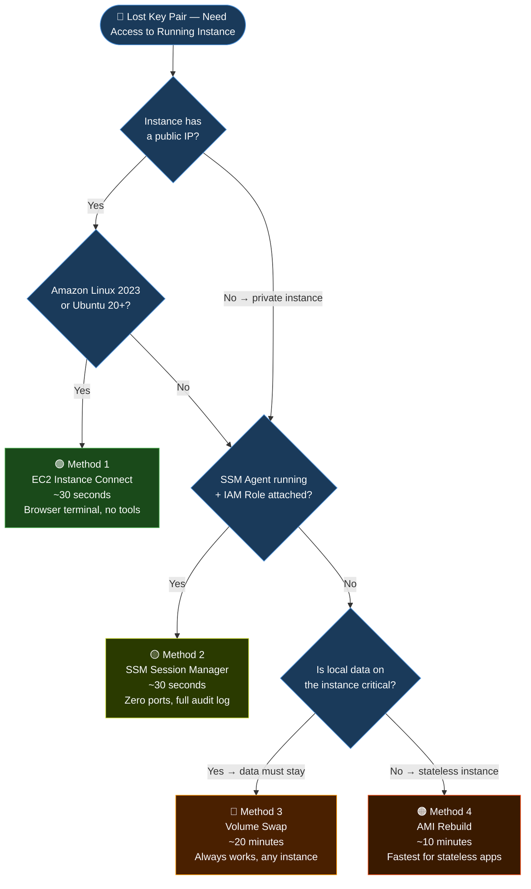

---

## 🖼️ AMI – Amazon Machine Image

📌 **Definition:** An AMI (Amazon Machine Image) is a **golden template** used to launch EC2 instances. It is a complete, point-in-time snapshot of a server — capturing the operating system, installed software, custom configurations, user accounts, application binaries, and EBS volume layout.

💡 **Simple analogy:** Think of an AMI like a **Docker image, but for a full virtual machine**. When you launch EC2 from an AMI, you get an exact replica of everything in that image — same OS version, same packages, same config. This is how teams eliminate configuration drift: every server in a fleet boots from the same image, guaranteed to be identical.

**Why this matters in production:** Teams build a **Golden AMI pipeline** in CI/CD. A job starts with a fresh base OS, installs runtime dependencies, applies OS hardening (disable root login, enable auditd, install CrowdStrike/Wazuh), installs the application runtime, then snapshots it as a versioned AMI. Auto Scaling Groups use this AMI. Every new instance boots pre-configured and production-ready in seconds — no manual setup, no configuration drift, no "works on my machine."

---

### 🧱 What an AMI Contains

```
┌──────────────────────────────────────────────────────────────┐
│                        AMI Package                           │
│                                                              │
│  ┌───────────────────────┐   ┌──────────────────────────┐   │
│  │     Root EBS Volume   │   │   Additional EBS Volumes  │   │
│  │  ─────────────────    │   │  ──────────────────────   │   │
│  │  • Operating system   │   │  • Application data disks │   │
│  │  • OS patches & conf  │   │  • Log storage volumes    │   │
│  │  • App runtime        │   │  • Cache or temp volumes  │   │
│  │  • App binaries       │   │  (optional, configurable) │   │
│  │  • Security agents    │   └──────────────────────────┘   │
│  └───────────────────────┘                                   │
│                                                              │
│  ┌──────────────────────────────────────────────────────┐   │
│  │                   AMI Metadata                        │   │
│  │  • Architecture: x86_64 or arm64 (Graviton)          │   │
│  │  • Virtualization: HVM (Hardware Virtual Machine)     │   │
│  │  • Root device type: EBS (persistent) or Instance    │   │
│  │    Store (ephemeral — data lost on stop/terminate)    │   │
│  │  • Launch permissions: private / public / shared      │   │
│  │  • Block device mappings (size, type, IOPS, encrypt) │   │
│  └──────────────────────────────────────────────────────┘   │
└──────────────────────────────────────────────────────────────┘
```

---

### 🗂️ AMI Types

| Type | Who Manages It | Trusted? | Use Case |
|---|---|---|---|
| **AWS-Provided** | Amazon | ✅ Fully | Standard OS images — Amazon Linux, Ubuntu, Windows Server |
| **AWS Marketplace** | Third-party vendors | ✅ Vetted | WordPress, Splunk, hardened RHEL, F5 BIG-IP, licensed SQL Server |
| **Custom / Golden AMI** | Your team | ✅ You verify | Production fleets, Auto Scaling Groups — your dependencies pre-baked |
| **Community AMIs** | Public users | ⚠️ Unverified | Experimental only — never in production without full audit |

> ⚠️ **Security rule:** Community AMIs are user-submitted and NOT reviewed by AWS. They could contain outdated software, security vulnerabilities, or malware. Always use AWS-provided AMIs or your own Golden AMIs in production.

---

### ⚙️ Building a Golden AMI — Full Step-by-Step

```
PHASE 1 — BUILD (configure a base instance)
──────────────────────────────────────────────────────────────────
STEP 1 → Launch a fresh EC2 instance from an AWS-provided base AMI
          Choose the latest Amazon Linux 2023 or Ubuntu LTS AMI
          Use a t3.medium or c6i.large for the build — doesn't need to be large

STEP 2 → SSH in and apply OS-level hardening:

         # Update all packages — apply security patches first
         sudo dnf update -y

         # Disable root SSH login
         sudo sed -i 's/^PermitRootLogin.*/PermitRootLogin no/' /etc/ssh/sshd_config

         # Disable password authentication (key-only)
         sudo sed -i 's/^PasswordAuthentication.*/PasswordAuthentication no/' /etc/ssh/sshd_config
         sudo systemctl restart sshd

         # Enable OS-level auditing
         sudo dnf install -y audit auditd
         sudo systemctl enable auditd && sudo systemctl start auditd

STEP 3 → Install your application runtime:
         sudo dnf install -y java-17-amazon-corretto   # Java
         sudo dnf install -y python3.11 python3.11-pip # Python
         sudo dnf install -y nginx                      # Web server

STEP 4 → Install monitoring and security agents:
         sudo dnf install -y amazon-cloudwatch-agent
         sudo dnf install -y amazon-ssm-agent
         sudo systemctl enable amazon-ssm-agent amazon-cloudwatch-agent

STEP 5 → Deploy or pre-pull application artifacts from S3:
         aws s3 cp s3://my-artifacts/myapp-v2.1.jar /opt/myapp/
         sudo systemctl enable myapp

STEP 6 → Test thoroughly — verify the app starts, health endpoint responds

PHASE 2 — CLEAN (remove sensitive data before snapshotting)
──────────────────────────────────────────────────────────────────
STEP 7 → Clean temp files, logs, and shell history:

         sudo rm -rf /tmp/*
         sudo rm -f /var/log/cloud-init*.log
         sudo find /var/log -type f -exec truncate -s 0 {} \;
         sudo rm -f /root/.bash_history /home/ec2-user/.bash_history
         history -c

         # Remove any credentials or secrets — they must come from Secrets Manager
         # NEVER bake secrets into an AMI

PHASE 3 — SNAPSHOT (create the versioned AMI)
──────────────────────────────────────────────────────────────────
STEP 8 → EC2 Console → Instances → Select the configured instance
STEP 9 → Actions → Image and Templates → Create Image

STEP 10 → Configure the image:
           Image name:  myapp-golden-v2.1-2026-04-07   ← use semantic versioning + date
           Description: Java 17, Nginx 1.24, CloudWatch Agent, SSM Agent — prod baseline
           No Reboot:   UNCHECK this — let AWS reboot for consistent filesystem snapshot

STEP 11 → Click "Create Image"
           AWS takes EBS snapshots → registers the AMI → status changes to "available"

STEP 12 → Tag the AMI for lifecycle management:
           Version    = v2.1
           Environment = production
           BuildDate   = 2026-04-07
           BaseAMI     = ami-xxxxxxxxxx  ← track what you built from
           Team        = platform
```

> 📸 `docs/images/ami-create-step1.png` — Actions → Image and Templates → Create Image
> 📸 `docs/images/ami-create-step2.png` — Image name, description, and volume configuration dialog

---

### 🔄 AMI Lifecycle Flow

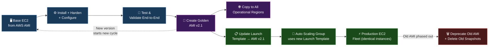

---

### 🌍 Cross-Region AMI Copy

AMIs are region-specific. If you operate in multiple regions for disaster recovery or latency, copy your Golden AMI to each region as part of your release pipeline:

```bash
# Copy Golden AMI from us-east-1 to eu-west-1 (Ireland) for DR
aws ec2 copy-image \
  --source-region us-east-1 \
  --source-image-id ami-0abcdef1234567890 \
  --region eu-west-1 \
  --name "myapp-golden-v2.1-eu-west-1" \
  --description "DR copy from us-east-1 — myapp v2.1"

# Returns: { "ImageId": "ami-0fedcba9876543210" } in eu-west-1
# Monitor copy status:
aws ec2 describe-images --region eu-west-1 \
  --image-ids ami-0fedcba9876543210 \
  --query 'Images[0].State'
```

> 💡 **Automate this:** Add AMI copy steps to your CI/CD pipeline (GitHub Actions or CodePipeline) so every Golden AMI is automatically distributed to all operational regions within minutes of creation. Never manually copy AMIs in production — human error in a DR process is the worst time to discover mistakes.

---

## 📦 Placement Groups

📌 **Definition:** Placement Groups let you explicitly control the **physical placement** of EC2 instances within AWS infrastructure — enabling you to optimise for ultra-low latency, fault isolation, or both, depending on your workload's priorities.

💡 **Why this matters:** By default, AWS places your instances on available hardware wherever capacity exists. For most workloads that is perfectly fine. But for specific scenarios, the physical relationship between machines is critical to correctness and performance:
- A Spark cluster where nodes communicate constantly benefits enormously from being on the same physical rack (sub-millisecond latency instead of 1–5ms)
- A Kafka cluster where you want broker failures to be independent requires each broker on separate hardware (fault isolation)
- A Zookeeper quorum where even a single rack failure must not lose quorum requires maximum hardware separation

Placement Groups let you express these requirements directly to AWS.

---

### 🗺️ Three Placement Strategies — Explained and Visualised

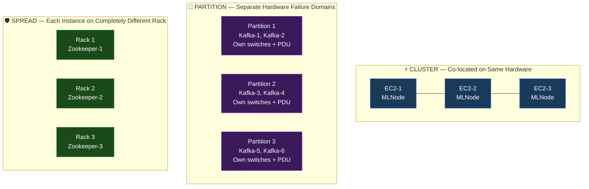

> 📸 `docs/images/placement-group-diagram.png`

---

### 📋 Placement Strategy Deep Dive

**Cluster Placement Group:**
Instances are packed onto hardware within the same physical rack or rack cluster in a single Availability Zone. This gives you the absolute lowest network latency (sub-millisecond, sometimes microseconds) and the highest network throughput — up to 100 Gbps between instances with enhanced networking. The trade-off is fault tolerance: if the rack has a power or network failure, all your instances could be affected simultaneously. Use for workloads where compute nodes communicate constantly and performance matters more than independent fault tolerance — HPC, ML training jobs, large Spark/Hadoop clusters.

**Partition Placement Group:**
Instances are distributed across logical "partitions." Each partition has its own dedicated set of physical hardware: its own network switches, its own power distribution units. If partition 1's hardware fails, partitions 2 and 3 are completely unaffected. You can span instances across multiple AZs. You can query which partition a specific instance is in — useful for distributing replicas. Use for distributed storage systems with built-in data replication: Kafka brokers, Cassandra nodes, HDFS DataNodes, Elasticsearch shards.

**Spread Placement Group:**
Each instance is placed on a completely separate, distinct physical rack with its own network and power feed. Maximum possible hardware fault isolation. The trade-off: limited to **7 instances per Availability Zone** per placement group. Use for small, critical components where hardware failure of a single rack must never impact more than one instance — Zookeeper quorum members, Kubernetes control plane nodes, primary database instances in an HA pair, bastion hosts.

| Strategy | Latency | Fault Isolation | Multi-AZ | Instance Limit | Best For |
|---|---|---|---|---|---|
| **Cluster** | Sub-millisecond | ❌ Rack-level risk | ❌ Single AZ only | Unlimited | HPC, ML training, tight Spark/Hadoop clusters |
| **Partition** | Low | ✅ Partition-level | ✅ Yes | 7 partitions/AZ, unlimited instances/partition | Kafka, Cassandra, HDFS, Elasticsearch |
| **Spread** | Normal | ✅ Rack-level (strongest) | ✅ Yes | 7 instances per AZ | Zookeeper, K8s masters, critical primary nodes |

---

### ⚙️ Creating and Using Placement Groups (CLI)

```bash
# Create a Cluster placement group for ML training
aws ec2 create-placement-group \
  --group-name "gpu-ml-training-cluster" \
  --strategy cluster

# Create a Partition placement group for Kafka
aws ec2 create-placement-group \
  --group-name "kafka-brokers-partition" \
  --strategy partition \
  --partition-count 3   # One partition per replica set

# Create a Spread placement group for critical nodes
aws ec2 create-placement-group \
  --group-name "zookeeper-quorum-spread" \
  --strategy spread

# Launch EC2 instances into a Cluster placement group
aws ec2 run-instances \
  --image-id ami-0abcdef1234567890 \
  --instance-type p4d.24xlarge \
  --placement "GroupName=gpu-ml-training-cluster" \
  --count 8 \
  --network-interfaces '[{"DeviceIndex":0,"InterfaceType":"efa"}]'
  # EFA (Elastic Fabric Adapter) for MPI/collective operations in Cluster groups

# List all placement groups and their status
aws ec2 describe-placement-groups \
  --query 'PlacementGroups[*].{Name:GroupName,Strategy:Strategy,State:State}'
```

> 💡 **Key operational note for Cluster groups:** Launch all instances in a single `run-instances` call using `--count N` whenever possible. If you launch in multiple batches, AWS may be unable to place later batches on the same physical hardware (you will see `InsufficientCapacityError`). The Cluster strategy requires AWS to reserve contiguous hardware upfront.

---

## ⚡ User Data – Bootstrap Automation

📌 **Definition:** User Data is a shell script (or cloud-init YAML configuration) you attach to an EC2 instance at launch time. It executes **automatically as root on the very first boot** — before any administrator logs in — installing software, writing configuration files, starting services, and fully bootstrapping your application.

💡 **Why this is essential in production:** You cannot manually SSH into every new instance in an Auto Scaling Group and install things. When a CPU spike triggers ASG to launch 20 new instances simultaneously, each one needs to go from "fresh OS" to "running application accepting traffic" automatically, consistently, and in under 2 minutes. User Data is the mechanism that makes automated, repeatable server provisioning possible.

Think of User Data as **the automated setup instructions you hand to every new server the moment it is born.** A well-written User Data script means any instance in your fleet is identical to every other — no configuration drift, no surprises.

---

### ⚙️ How User Data Works Internally

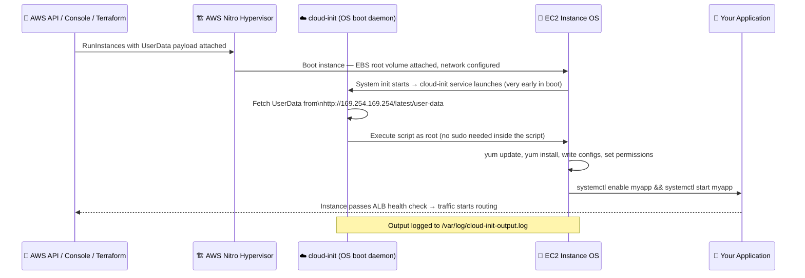

> 📸 `docs/images/userdata-console-step1.png` — Where to enter your script: Launch wizard → Advanced Details → scroll to "User data" field at the bottom

**Critical User Data behaviour rules:**
- Runs **only once by default** — at first boot after the instance is launched
- Runs as the **root user** — no sudo prefix needed inside the script
- Must begin with `#!/bin/bash` (shell script) or `#cloud-config` (cloud-init YAML)
- All output is logged to `/var/log/cloud-init-output.log` — your debugging bible
- Maximum size: 16 KB plain text. For larger scripts, upload to S3 and download inside User Data
- Instance status checks may show "initializing" while User Data is running

---

### 🧪 Practical Example — Production Apache Web Server Bootstrap

```bash
#!/bin/bash
# ─────────────────────────────────────────────────────────────────────
# Production User Data Script — Apache Web Server
# Compatible with: Amazon Linux 2023 / Amazon Linux 2
# Purpose: Update OS, install Apache, deploy app, enable monitoring
# ─────────────────────────────────────────────────────────────────────

# Exit immediately if any command fails (fail fast, not silently)
set -e
set -o pipefail

LOG="/var/log/userdata-bootstrap.log"
echo "=== EC2 Bootstrap Starting: $(date) ===" | tee -a $LOG

# ── 1. Update all OS packages (apply security patches) ───────────────
echo "[1/5] Updating OS packages..." | tee -a $LOG
yum update -y >> $LOG 2>&1
echo "      OS update complete" | tee -a $LOG

# ── 2. Install Apache web server ─────────────────────────────────────
echo "[2/5] Installing Apache (httpd)..." | tee -a $LOG
yum install -y httpd >> $LOG 2>&1

# ── 3. Fetch instance identity from metadata (IMDSv2) ─────────────────
TOKEN=$(curl -s -X PUT "http://169.254.169.254/latest/api/token" \
  -H "X-aws-ec2-metadata-token-ttl-seconds: 60")
INSTANCE_ID=$(curl -s -H "X-aws-ec2-metadata-token: $TOKEN" \
  http://169.254.169.254/latest/meta-data/instance-id)
AZ=$(curl -s -H "X-aws-ec2-metadata-token: $TOKEN" \
  http://169.254.169.254/latest/meta-data/placement/availability-zone)
INSTANCE_TYPE=$(curl -s -H "X-aws-ec2-metadata-token: $TOKEN" \
  http://169.254.169.254/latest/meta-data/instance-type)

# ── 4. Deploy the application HTML page ──────────────────────────────
echo "[3/5] Deploying application page..." | tee -a $LOG
cat > /var/www/html/index.html <<EOF
<!DOCTYPE html>
<html lang="en">
<head>
  <meta charset="UTF-8">
  <title>EC2 Instance Info</title>
</head>
<body style="font-family:Arial,sans-serif;background:#0d1117;color:#e6edf3;padding:40px;max-width:600px">
  <h1>🚀 EC2 Instance Ready!</h1>
  <table border="0" cellpadding="8">
    <tr><td><b>Instance ID</b></td><td>$INSTANCE_ID</td></tr>
    <tr><td><b>Availability Zone</b></td><td>$AZ</td></tr>
    <tr><td><b>Instance Type</b></td><td>$INSTANCE_TYPE</td></tr>
    <tr><td><b>Bootstrapped At</b></td><td>$(date)</td></tr>
  </table>
  <p style="color:#3fb950">✅ Apache running via User Data automation</p>
</body>
</html>
EOF

# ── 5. Enable and start Apache (persists across reboots) ──────────────
echo "[4/5] Enabling and starting Apache..." | tee -a $LOG
systemctl enable httpd >> $LOG 2>&1
systemctl start httpd >> $LOG 2>&1

# ── 6. Install CloudWatch Agent (production monitoring) ───────────────
echo "[5/5] Installing CloudWatch Agent..." | tee -a $LOG
yum install -y amazon-cloudwatch-agent >> $LOG 2>&1
/opt/aws/amazon-cloudwatch-agent/bin/amazon-cloudwatch-agent-ctl \
  -a fetch-config -m ec2 -s -c default >> $LOG 2>&1

echo "=== Bootstrap Complete: $(date) ===" | tee -a $LOG
```

**Verify it worked:**
```bash
# Check in your browser:
http://<Public-IP>

# Or from terminal:
curl -s http://<Public-IP> | grep "Instance ID"

# Check the bootstrap log on the instance after SSHing in:
sudo tail -50 /var/log/userdata-bootstrap.log
sudo tail -100 /var/log/cloud-init-output.log
```

---

### 🔁 Modifying User Data After Launch

By default, User Data **only runs once** — at first boot. Here is how to update it and optionally re-run it.

**Editing User Data on an existing instance:**

```
IMPORTANT: The instance must be STOPPED before you can edit User Data
           You cannot edit User Data on a running instance

STEP 1 → Stop the instance
          EC2 → Instances → Instance State → Stop → Wait for "stopped" status

STEP 2 → Edit User Data
          EC2 → Instances → Actions → Instance Settings → Edit User Data

STEP 3 → Paste your updated script (replaces the old one entirely)

STEP 4 → Start the instance
          EC2 → Instances → Instance State → Start
          NOTE: The updated script does NOT auto-run on this start
                cloud-init records that it has already run
```

**Force re-execution of User Data on next reboot:**
```bash
# SSH into the instance first, then:

# Clear cloud-init's run record — tells it to re-execute on next boot
sudo cloud-init clean --logs

# Reboot the instance
sudo reboot

# After reboot, check that it re-ran:
sudo cat /var/log/cloud-init-output.log
```

---

### ✅ Real-World Scenarios for Updating User Data

| Scenario | Problem | Solution via User Data |
|---|---|---|
| **Missed package installation** | First script forgot `yum install -y wget` | Add line, clean cloud-init, reboot |
| **New app version to deploy** | Updated artifact needs to be pulled on boot | Update S3 download URL or version variable |
| **Add observability agent** | Every instance needs CloudWatch/Datadog | Add agent install + config block to script |
| **ASG launch behaviour change** | New instances need different startup config | Update script → all future ASG instances use it |
| **Golden AMI baking** | Create pre-configured snapshot for fleet | Run full setup → verify → create AMI from instance |
| **cloud-init failure** | First boot failed: network was down, typo in script | Fix script, clean cloud-init state, reboot |
| **OS hardening addition** | Security team requires auditd and fail2ban | Add install + enable commands to script |
| **Secrets rotation approach** | Move from hardcoded values to Secrets Manager | Update script to call `aws secretsmanager get-secret-value` |

---

## 🔎 EC2 Instance Metadata

📌 **Definition:** EC2 Instance Metadata is a **link-local HTTP API** available at `http://169.254.169.254` inside every running EC2 instance. It is served by the AWS Nitro hypervisor directly — no network hop, no internet required. It exposes real-time, accurate information about the instance: its ID, type, public/private IPs, IAM role credentials, placement details, Spot interruption notices, and more.

💡 **Why it exists:** Your application running inside EC2 often needs to know things about its own environment — without those values being hardcoded into config files or injected as environment variables. The metadata API provides a dynamic, always-accurate, zero-configuration discovery mechanism. Applications can call it at startup to find their own instance ID, AZ, region, or retrieve short-lived IAM credentials for AWS SDK calls — completely without embedding secrets in code.

> 🏭 **Real-world examples:**
> - A deployment agent queries instance ID and registers it with Consul for service discovery
> - A monitoring agent reads the AZ and region to tag all metrics correctly
> - An application uses the IAM credentials endpoint to call S3/DynamoDB without hardcoded access keys
> - An ASG worker polls the Spot interruption endpoint to checkpoint before termination

---

### 🔐 IMDSv1 vs IMDSv2 — Always Enforce IMDSv2

> ⚠️ **Critical security topic:** IMDSv1 is vulnerable to **Server-Side Request Forgery (SSRF)** attacks. In an SSRF attack, a malicious actor tricks your web application into making HTTP requests to internal addresses. If your app is vulnerable and IMDSv1 is enabled, they can steal your instance's temporary IAM credentials with a single crafted request — then act as your EC2's IAM role in your AWS account.

| Version | Request Flow | SSRF Vulnerable? | Status |
|---|---|---|---|
| **IMDSv1** | Simple GET — no authentication needed | ✅ Yes — trivially exploitable | Legacy — disable everywhere |
| **IMDSv2** | PUT first to get token → use token in GET | ❌ No — requires PUT capability | Required — enforce account-wide |

IMDSv2 protects against SSRF because SSRF exploits typically only issue GET requests (following a redirect or a crafted URL). The IMDSv2 token requires a `PUT` HTTP method — which SSRF cannot perform in most cases.

---

### 🌐 Using Metadata Safely with IMDSv2

```bash
# ─────────────────────────────────────────────────────────────────
# STEP 1: Get a session token (required for all IMDSv2 requests)
# TTL of 21600 seconds = 6 hours — reuse this token for that period
# ─────────────────────────────────────────────────────────────────
TOKEN=$(curl -s -X PUT "http://169.254.169.254/latest/api/token" \
  -H "X-aws-ec2-metadata-token-ttl-seconds: 21600")

# ─────────────────────────────────────────────────────────────────
# STEP 2: Use the token in all metadata API calls
# ─────────────────────────────────────────────────────────────────

# Instance ID — unique identifier for this VM
curl -s -H "X-aws-ec2-metadata-token: $TOKEN" \
  http://169.254.169.254/latest/meta-data/instance-id
# → i-0abcdef1234567890

# Instance Type — what hardware profile this machine has
curl -s -H "X-aws-ec2-metadata-token: $TOKEN" \
  http://169.254.169.254/latest/meta-data/instance-type
# → m7g.large

# Public IPv4 — internet-facing IP (only present if assigned)
curl -s -H "X-aws-ec2-metadata-token: $TOKEN" \
  http://169.254.169.254/latest/meta-data/public-ipv4

# Private IPv4 — VPC-internal IP (always present)
curl -s -H "X-aws-ec2-metadata-token: $TOKEN" \
  http://169.254.169.254/latest/meta-data/local-ipv4

# Availability Zone — which AZ this instance is in
curl -s -H "X-aws-ec2-metadata-token: $TOKEN" \
  http://169.254.169.254/latest/meta-data/placement/availability-zone
# → us-east-1b

# AWS Region — derived directly (no trimming needed)
curl -s -H "X-aws-ec2-metadata-token: $TOKEN" \
  http://169.254.169.254/latest/meta-data/placement/region
# → us-east-1

# AMI ID — what image this instance was launched from
curl -s -H "X-aws-ec2-metadata-token: $TOKEN" \
  http://169.254.169.254/latest/meta-data/ami-id

# IAM Role name — which role is attached to this instance
curl -s -H "X-aws-ec2-metadata-token: $TOKEN" \
  http://169.254.169.254/latest/meta-data/iam/security-credentials/
# Returns the role name — then fetch credentials:
ROLE_NAME=$(curl -s -H "X-aws-ec2-metadata-token: $TOKEN" \
  http://169.254.169.254/latest/meta-data/iam/security-credentials/)
curl -s -H "X-aws-ec2-metadata-token: $TOKEN" \
  http://169.254.169.254/latest/meta-data/iam/security-credentials/$ROLE_NAME
# Returns: AccessKeyId, SecretAccessKey, Token (STS temporary credentials, auto-rotated)

# Spot interruption notice (empty/404 = safe, JSON = termination imminent)
curl -s -H "X-aws-ec2-metadata-token: $TOKEN" \
  http://169.254.169.254/latest/meta-data/spot/instance-action

# Explore all available metadata keys from the root
curl -s -H "X-aws-ec2-metadata-token: $TOKEN" \
  http://169.254.169.254/latest/meta-data/
```

> 📸 `docs/images/metadata-curl-output.png` — Terminal output showing metadata API responses

---

### 🛡️ Enforcing IMDSv2 Everywhere

**At launch (Terraform — the right way to create instances):**
```hcl
metadata_options {
  http_endpoint               = "enabled"
  http_tokens                 = "required"    # Enforce IMDSv2 — disables IMDSv1
  http_put_response_hop_limit = 1             # Prevents containers inside EC2 from accessing metadata
}
```

**On an existing running instance:**
```bash
# Enforce IMDSv2 on a specific running instance (no restart needed)
aws ec2 modify-instance-metadata-options \
  --instance-id i-0123456789abcdef0 \
  --http-tokens required \
  --http-put-response-hop-limit 1 \
  --region us-east-1
```

**Account-level default (enforce on all NEW instances automatically):**
```bash
# This prevents any new instance from being launched without IMDSv2
aws ec2 modify-instance-metadata-defaults \
  --http-tokens required \
  --http-put-response-hop-limit 2  # 2 allows containers inside EC2 to also use IMDS
  --region us-east-1
```

---

### 📊 Metadata vs. User Data vs. Tags — Key Differences

| Attribute | Metadata | User Data | Instance Tags |
|---|---|---|---|
| **What it is** | Auto-generated instance facts (by AWS) | Your bootstrap script (you wrote it) | Custom key-value labels (you define them) |
| **Access URL** | `169.254.169.254/latest/meta-data/` | `169.254.169.254/latest/user-data` | AWS API / Console / SDK |
| **When populated** | Automatically at launch by AWS | You provide it before launch | You set them anytime before or after launch |
| **Read/Write** | Read-only from inside instance | Read-only from inside instance | Read + Write via API anytime |
| **Changes over time** | Partially dynamic (public IP changes on stop/start) | Static after launch (edit requires stop) | Editable any time, no restart needed |
| **Primary use** | App self-discovery, IAM credential retrieval | First-boot automation, package installation | Cost allocation, filtering, IaC targeting |

---

## 🧩 Multi-Layer System Design

> This section shows how EC2 fits into a **production-grade, multi-tier architecture** — the way real enterprise systems are actually designed, operated, and maintained at scale. This is the mindset shift from "I have an EC2 instance" to "I designed a resilient, observable, cost-optimised system."

---

### 🔷 High-Level View — 3-Tier Web Application

The three-tier architecture is the foundation of most internet-facing applications. Each tier has a single responsibility, communicates only with its adjacent tier, and scales independently based on its own metrics.

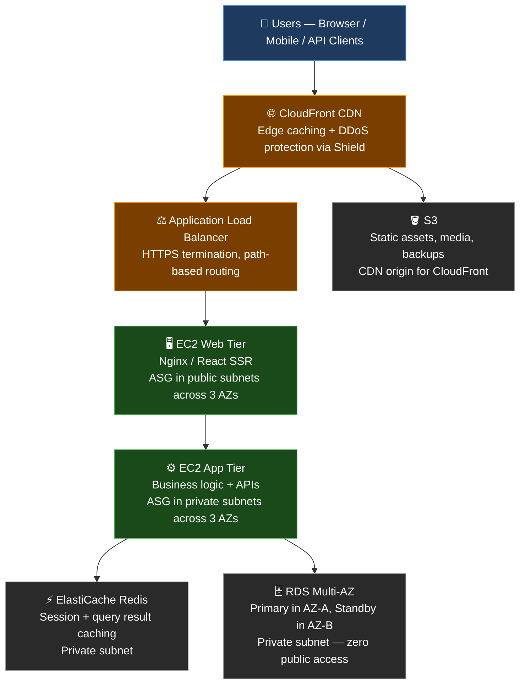

**Why each tier is separated:**
- **Web tier (public subnets):** Only handles HTTP/HTTPS — serves static content, proxies API calls to app tier. Exposed to internet via load balancer. Stateless — any instance can handle any request.
- **App tier (private subnets):** Contains business logic, database queries, third-party integrations. Never directly exposed to internet. Instances have no public IPs — they reach the internet via a NAT Gateway for outbound calls only.
- **Data tier (private subnets):** Databases and caches have no public IPs, no internet gateway routes. Only reachable from the app tier's Security Group. RDS Multi-AZ automatically fails over to the standby replica if the primary AZ has an outage.

---

### 🔷 Mid-Level View — Auto Scaling and Health Checks

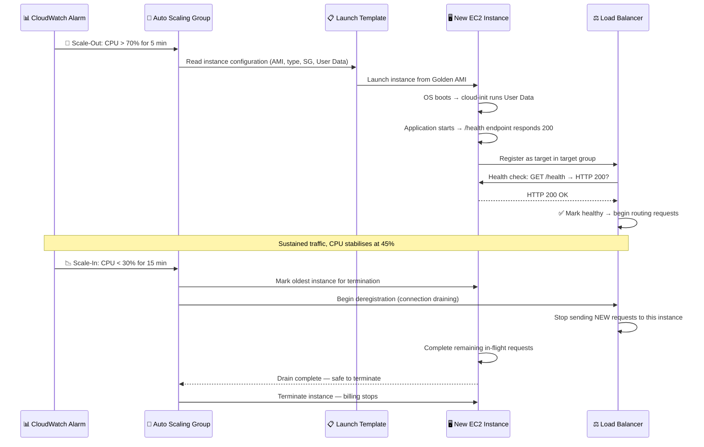

---

### 🔷 Deep-Level View — Failure Recovery (SRE Mindset)

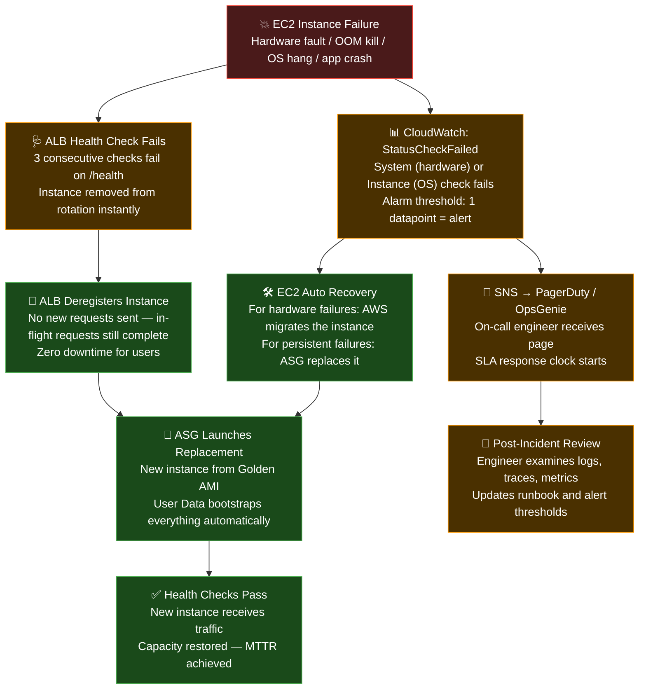

> 📸 `docs/images/failure-recovery-flow.png`

**Key SRE principles at work:**
- Automation handles instance replacement — no human required for routine failures
- Humans are only paged when automation cannot self-heal (cascading failure, AZ outage)
- Root cause analysis happens after recovery — never during the incident under pressure

---

## 📐 Architecture Diagrams

### 🔄 End-to-End Request Lifecycle — Complete Trace

This sequence shows what happens at every level when a user makes a request to your EC2-hosted application — every network hop, every service call, including cache hit/miss handling.

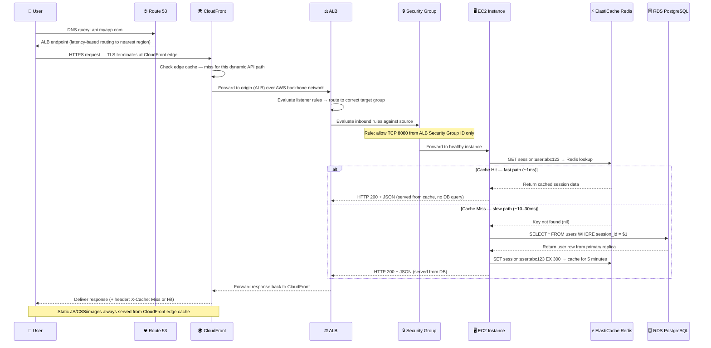

> 

---

## ⚙️ Configuration Reference

| Parameter | Example Value | Description | Production Notes |
|---|---|---|---|
| `AMI_ID` | `ami-0abcdef1234567890` | OS image used to launch the instance | Use your own Golden AMI in production |
| `INSTANCE_TYPE` | `t3.micro` / `m7g.large` | Hardware profile (CPU, RAM, network) | Always use latest generation |
| `KEY_NAME` | `my-prod-keypair` | SSH key pair stored in AWS | Prefer SSM over key pairs in production |
| `SECURITY_GROUP_ID` | `sg-0123456789abcdef0` | Firewall rules controlling traffic | Principle of least privilege |
| `SUBNET_ID` | `subnet-0123456789abcdef0` | VPC subnet for network placement | Private subnet for app/DB tiers |
| `IAM_INSTANCE_PROFILE` | `EC2-SSM-CloudWatch-Role` | IAM role granting AWS service access | Minimum required permissions only |
| `USER_DATA_FILE` | `userdata/bootstrap.sh` | Path to first-boot automation script | Test in dev environment first |
| `EBS_VOLUME_TYPE` | `gp3` | EBS storage type | gp3 default; io2 for high-IOPS DB |
| `EBS_SIZE_GB` | `20` | Root volume size in gigabytes | Right-size: don't over-provision |
| `EBS_IOPS` | `3000` | Provisioned IOPS (gp3 = 3000 free) | Increase for database workloads |
| `PLACEMENT_GROUP` | `hpc-cluster-pg` | Placement group name (optional) | HPC and ML workloads only |
| `METADATA_OPTIONS` | `http_tokens = required` | IMDSv2 enforcement | Always set — disables IMDSv1 |
| `MONITORING` | `detailed` | CloudWatch monitoring granularity | Detailed = 1-min intervals |

---

### 🧱 Complete Production Terraform Example

```hcl
# ─────────────────────────────────────────────────────────────────────
# Production EC2 Instance — All Best Practices Applied
# ─────────────────────────────────────────────────────────────────────

resource "aws_instance" "app_server" {
  ami                    = var.golden_ami_id           # Your Golden AMI — not a raw OS
  instance_type          = var.instance_type            # e.g. m7g.large
  key_name               = var.key_pair_name            # Fallback — prefer SSM in prod
  subnet_id              = var.private_subnet_id        # App tier always in private subnet
  vpc_security_group_ids = [aws_security_group.app_sg.id]
  iam_instance_profile   = aws_iam_instance_profile.ec2_profile.name

  # 1-minute CloudWatch metric granularity (default is 5-minute)
  monitoring = true

  # ── CRITICAL: Enforce IMDSv2 ──────────────────────────────────────
  # http_put_response_hop_limit = 1 prevents nested containers
  # inside EC2 from accessing instance metadata (extra security layer)
  metadata_options {
    http_endpoint               = "enabled"
    http_tokens                 = "required"   # Disable IMDSv1 entirely
    http_put_response_hop_limit = 1
  }

  # ── Root EBS Volume ───────────────────────────────────────────────
  # gp3 provides 3,000 IOPS and 125 MB/s throughput free of charge
  # gp3 is 20% cheaper than gp2 for the same performance
  # Always encrypt — no performance impact on modern Nitro instances
  root_block_device {
    volume_type           = "gp3"
    volume_size           = 20
    iops                  = 3000
    throughput            = 125
    encrypted             = true
    kms_key_id            = var.ebs_kms_key_arn  # Your own CMK for compliance
    delete_on_termination = true
  }

  # ── User Data runs on first boot only ─────────────────────────────
  user_data = file("${path.module}/userdata/bootstrap.sh")

  # ── Tags — Required for cost allocation and resource governance ───
  tags = {
    Name        = "prod-app-server"
    Environment = "production"
    Team        = "platform-engineering"
    Service     = "api-backend"
    ManagedBy   = "terraform"
    CostCenter  = "eng-001"
  }

  # ── Lifecycle: prevent accidental termination ─────────────────────
  lifecycle {
    prevent_destroy = true  # Requires -target=... to destroy — safety net
  }
}
```

---

## 🔐 Security Best Practices Checklist

Use this as a **production readiness gate** before any EC2 deployment goes live:

| Priority | Practice | Why It Matters |
|---|---|---|
| 🔴 Critical | **IAM Roles** — never hardcode access keys on EC2 | Hardcoded keys leak to Git, logs, crash dumps, and AMI snapshots |
| 🔴 Critical | **IMDSv2 enforced** — disable IMDSv1 | IMDSv1 is exploitable via SSRF to steal IAM credentials |
| 🔴 Critical | **No SSH port 22 to 0.0.0.0/0** ever | Open SSH is brute-forced within minutes by automated scanners |
| 🔴 Critical | **SSM Session Manager** instead of bastion/SSH | Zero open ports + full audit log + no key management overhead |
| 🟠 High | **EBS encryption at rest** on all volumes | Protects data if physical drive is removed from decommissioned hardware |
| 🟠 High | **Private subnets** for all app and DB tiers | No direct internet exposure for non-public-facing services |
| 🟠 High | **CloudTrail enabled** in all regions | Full API audit trail — required for SOC 2, PCI, ISO 27001 |
| 🟠 High | **Secrets Manager / Parameter Store** — not User Data — for secrets | User Data is stored in plaintext in instance metadata |
| 🟡 Medium | **Amazon Inspector** for CVE scanning | Continuously scans OS packages and ECR images for known vulnerabilities |
| 🟡 Medium | **AWS Config rules** for drift detection | Alerts when Security Groups or IAM is modified outside of IaC |
| 🟡 Medium | **VPC Flow Logs** enabled | Captures all network traffic for anomaly detection and forensics |
| 🟡 Medium | **Termination protection** on critical instances | Prevents accidental terminate from Console, CLI, or automation |
| 🟢 Standard | **Consistent resource tagging** | Required for cost attribution, filtering, and automation targeting |
| 🟢 Standard | **Patch management** via Systems Manager Patch Manager | Automates OS patch compliance across your entire EC2 fleet |

---

## 🎥 Animation Library

| Animation | File Path | What It Shows |
|---|---|---|
| Request Flow | `assets/animations/request_flow.gif` | Full user request: DNS → CloudFront → ALB → EC2 → DB → response |
| System Interaction | `assets/animations/system_interaction.mp4` | EC2 integrating with S3, RDS, ElastiCache, CloudWatch in real time |
| Failure Recovery | `assets/animations/failure_recovery.gif` | Instance failure → ALB health check → ASG replacement → traffic restored |
| Scaling Behaviour | `assets/animations/scaling_behavior.gif` | CPU spike → CloudWatch alarm → ASG scale-out → new instances added |

---

## 🧰 Interactive Tools

| Tool | Purpose | Link |
|---|---|---|
| Lucidchart | Interactive, shareable architecture diagrams with AWS icon library | [lucidchart.com](https://lucidchart.com) |
| Miro | Collaborative real-time system design whiteboard | [miro.com](https://miro.com) |
| Figma | Visual system design, wireframes, and UI mockups | [figma.com](https://figma.com) |
| Whimsical | Clean flow diagrams, mind maps, and user flows | [whimsical.com](https://whimsical.com) |
| draw.io | Free, open-source diagrams with AWS stencils — works offline | [draw.io](https://draw.io) |
| AWS Architecture Center | Official AWS reference architectures and whitepaper library | [aws.amazon.com/architecture](https://aws.amazon.com/architecture) |

---

## 🤝 Contributing

```bash
# 1. Fork this repository on GitHub

# 2. Clone your fork
git clone https://github.com/your-username/cloud-devops-mastery.git
cd cloud-devops-mastery

# 3. Create a descriptive feature branch
git checkout -b feature/ec2-advanced-networking
# or
git checkout -b fix/ami-explanation-correction
# or
git checkout -b docs/add-eks-section

# 4. Make changes — follow the section format:
#    📌 Definition (1–2 lines, clear and precise)
#    💡 Real-world explanation with an analogy
#    🧪 Practical code example — copy-paste ready and tested
#    ⚙️ Step-by-step workflow (numbered, explicit)
#    📸 Screenshot placeholder with descriptive label
#    Mermaid diagram if there is a flow, sequence, or architecture to show

# 5. Commit with a clear message
git add .
git commit -m "docs: add IMDSv2 enforcement patterns to metadata section"

# 6. Push and open a Pull Request with a clear description
git push origin feature/ec2-advanced-networking
```

> 📌 **Contribution standards:** Keep language beginner-friendly. Every technical concept needs a real-world analogy. Every code block must be tested and copy-paste ready. Diagrams must render correctly in GitHub dark mode. No vendor jargon without a one-sentence explanation.

---

## 📜 License

This project is licensed under the **MIT License** — free to use, share, adapt, and build upon for personal, educational, and commercial purposes.

---

<div align="center">

## ❤️ Found This Useful?

**⭐ Star this repo** — bookmark it and help other engineers find it

**🍴 Fork it** — build your own personalised cloud learning library on top of this foundation

**📢 Share it** — with your team, your bootcamp cohort, or your engineering community

---

*Built by engineers, for engineers — with ☁️ and ❤️*

*"The best way to learn cloud is to design it, break it, and rebuild it better."*

</div>
