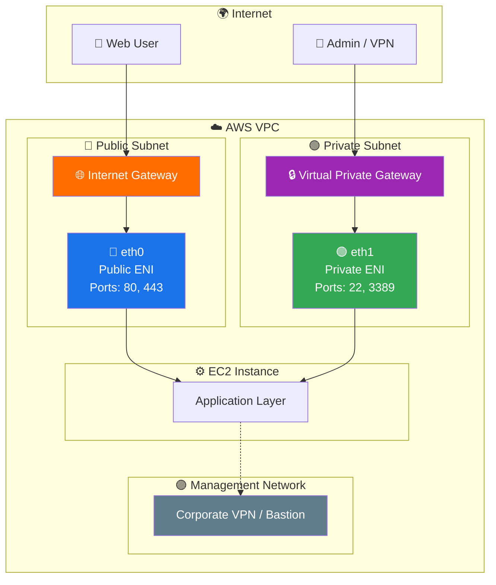
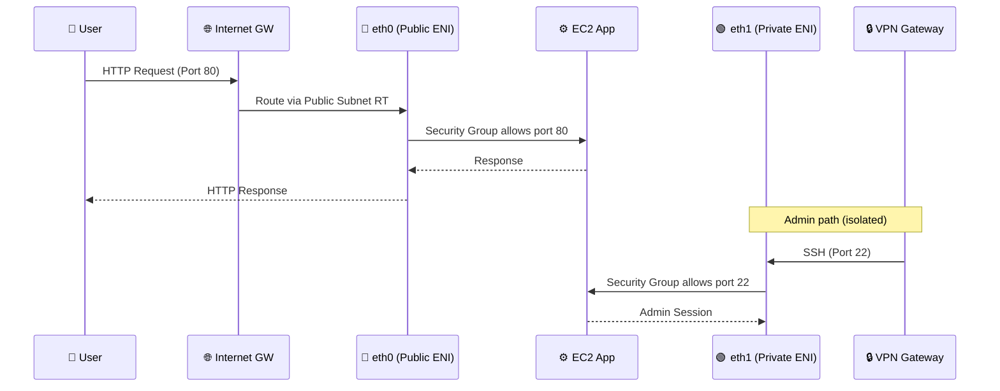
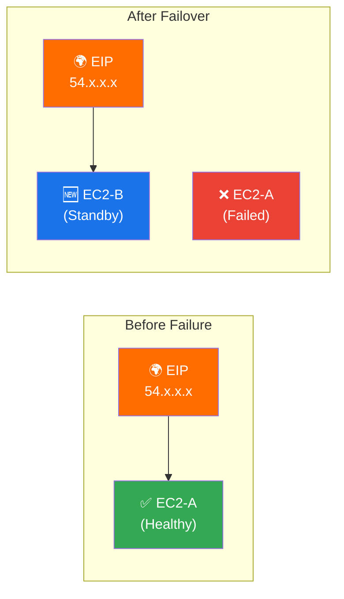
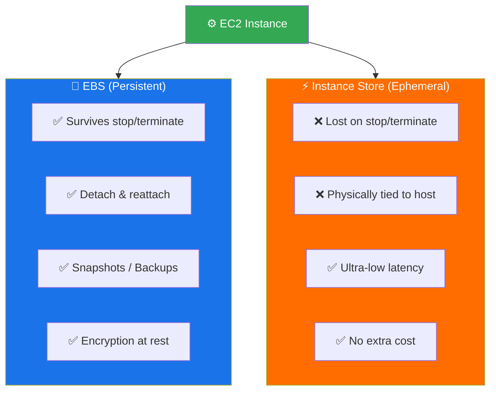
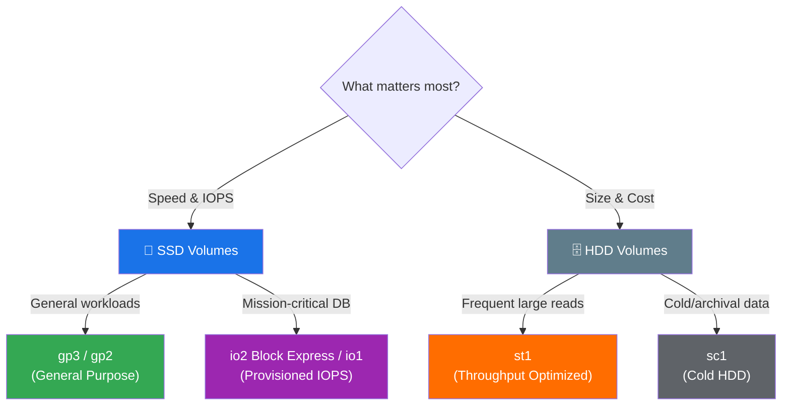
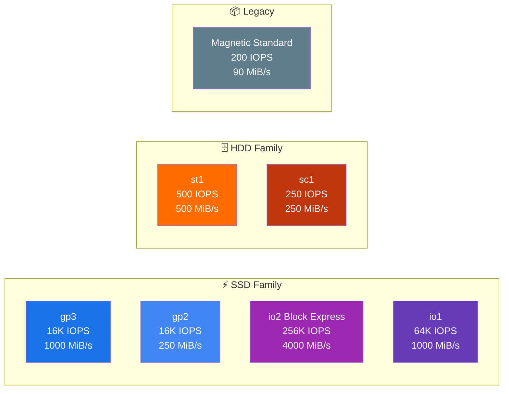
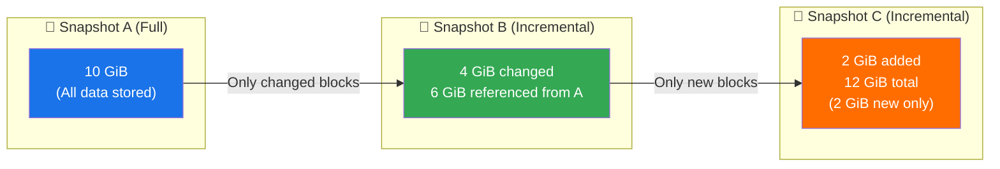
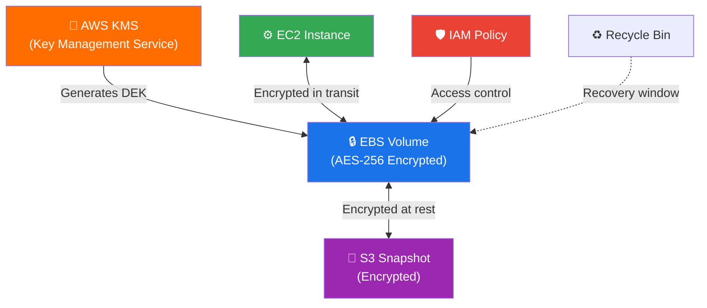
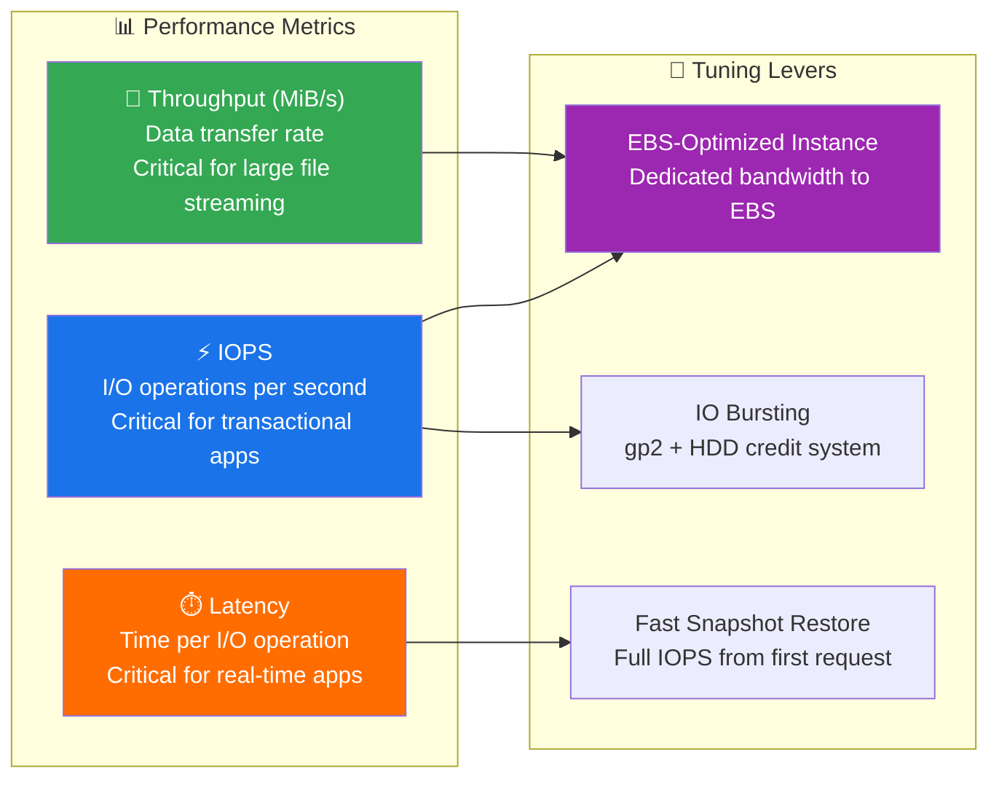
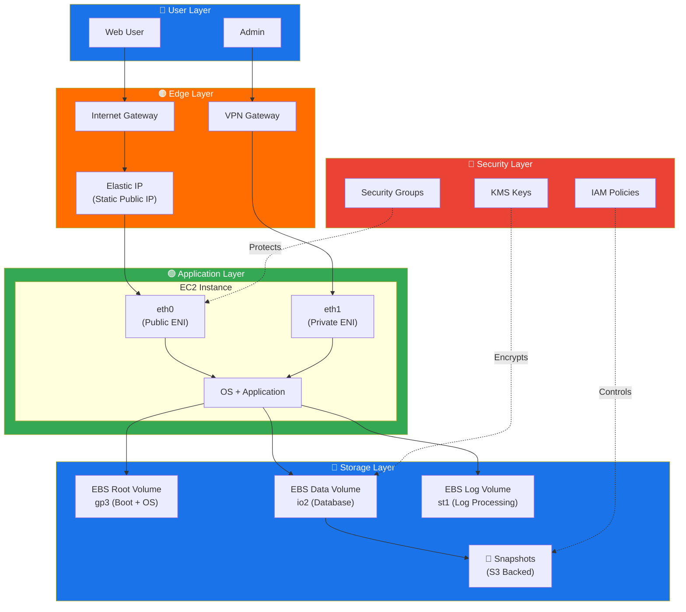

<div align="center">

# 🌩️ Cloud & DevOps Mastery – Visual Architecture Learning System

### *Enterprise-Grade AWS Networking & Storage — From Zero to Production*

[](https://github.com)
[](https://github.com)
[](LICENSE)
[](CONTRIBUTING.md)

</div>

---

## 🏆 Project Goal

> This repository transforms raw cloud concepts into a **living, visual learning system** — built for engineers at every level. Whether you're launching your first EC2 instance or designing multi-region fault-tolerant architectures, this guide walks you through **real-world system design**, **animated architecture thinking**, and **step-by-step production workflows** so you can build cloud systems that actually work under pressure.

---

## 🎬 Project Preview

```
📸 docs/images/demo.gif                        ← Full system walkthrough animation
📸 docs/images/architecture.png               ← High-level AWS networking overview
📸 docs/images/eni-dual-interface.png         ← ENI dual-interface topology
📸 docs/images/ebs-volume-types.png           ← EBS volume comparison chart
📸 docs/images/snapshot-incremental.png       ← Incremental snapshot flow
📸 assets/animations/request_flow.gif        ← EC2 traffic request lifecycle
📸 assets/animations/failure_recovery.gif    ← EIP failover animation
📸 assets/animations/scaling_behavior.gif    ← Auto-scaling under load
```

---

## 📚 Table of Contents

| # | Topic | Level |
|---|-------|-------|
| 1 | [🌐 Elastic Network Interface (ENI)](#-elastic-network-interface-eni) | Beginner → Advanced |
| 2 | [🔷 ENI Key Components](#-eni-key-components) | Intermediate |
| 3 | [🏗️ Dual-Interface Architecture Pattern](#%EF%B8%8F-dual-interface-architecture-pattern) | Advanced |
| 4 | [🌍 Elastic IP (EIP)](#-elastic-ip-eip) | Beginner → Intermediate |
| 5 | [💽 EC2 Storage & EBS](#-ec2-storage--amazon-ebs) | Beginner |
| 6 | [📊 EBS Volume Types Deep Dive](#-ebs-volume-types-deep-dive) | Intermediate → Advanced |
| 7 | [📸 EBS Snapshots](#-ebs-snapshots--backup-strategy) | Intermediate |
| 8 | [🔐 EBS Security & Encryption](#-ebs-security--encryption) | Intermediate |
| 9 | [⚡ EBS Performance Tuning](#-ebs-performance-tuning) | Advanced |
| 10 | [🧩 Specialized EBS Features](#-specialized-ebs-features) | Advanced |
| 11 | [🎨 Full System Architecture](#-full-system-architecture) | All Levels |
| 12 | [🔧 Hands-On Labs](#-hands-on-labs) | All Levels |
| 13 | [📚 Interactive Tools](#-interactive-tools) | Reference |
| 14 | [🤝 Contributing](#-contributing) | — |

---

## 🌐 Elastic Network Interface (ENI)

### 📌 Definition
An **Elastic Network Interface (ENI)** is a virtual NIC (Network Interface Card) inside an AWS VPC. It gives your EC2 instance network identity — IP addresses, security group rules, and routing behavior — all in one logical object.

### 💡 Real-World Analogy
> 🪪 **Think of it like a SIM card.** If you move your SIM from one phone to another, your phone number, data plan, and contacts follow. Similarly, when you move an ENI from one EC2 instance to another, the IP address, MAC address, and security groups all follow — and network traffic is automatically redirected to the new instance.

### 🧪 Why It Matters in Production
- **Zero-downtime failover** → Detach ENI from a failed instance, attach to standby → same IP, no DNS change needed
- **Multi-homed instances** → One instance, multiple network paths (public + private)
- **Licensing tied to MAC address** → Some software licenses lock to MAC; ENIs keep the MAC stable across reboots and moves

---

## 🔷 ENI Key Components

| Component | What It Is | Production Use |
|-----------|-----------|----------------|
| **Primary Private IPv4** | Mandatory IP assigned at creation | Instance-to-instance communication |
| **Secondary Private IPv4** | Optional extra IPs on same ENI | Host multiple apps on one instance |
| **Elastic IP (EIP)** | Static public IP linked to private IP | Internet-facing services, failover |
| **MAC Address** | Unique hardware-level identifier | Software licensing, network tracking |
| **Security Groups** | Stateful firewall rules | Port-level access control |
| **Source/Destination Check** | Validates traffic ownership | Must disable for NAT instances/routers |

### 📌 IP Density per Instance Type

> Different instance types support different numbers of ENIs and IPs per ENI. For example:
> - `a1.xlarge` → 4 ENIs × 15 IPs each = **60 private IPs max**
> - Always check the [AWS ENI limits table](https://docs.aws.amazon.com/AWSEC2/latest/UserGuide/using-eni.html) before designing multi-homed architectures.

```
📸 docs/images/eni-ip-density-table.png    ← EC2 instance type vs ENI/IP count matrix
```

---

## 🏗️ Dual-Interface Architecture Pattern

### 🔷 High-Level View

```
                    ┌─────────────────────────────────┐
                    │         EC2 Instance             │
                    │                                   │
       Internet ──▶ │  eth0 (Public ENI)               │
                    │  eth1 (Private/Management ENI)    │
                    │                                   │
                    └─────────────────────────────────┘
```

### 🔷 Mid-Level View — Traffic Separation



### 🔷 Deep-Level View — Request Lifecycle



```
📸 docs/images/eni-dual-interface-step1.png    ← Public traffic flow
📸 docs/images/eni-dual-interface-step2.png    ← Management traffic flow
📸 assets/animations/request_flow.gif         ← Animated end-to-end flow
```

### ⚙️ Step-by-Step: Create & Attach ENI

```
Step 1 → EC2 Console → Network Interfaces → Create Network Interface
         ├── Select Subnet (Public or Private)
         ├── Assign Private IP
         └── Attach Security Group

Step 2 → Launch EC2 Instance (or use existing)

Step 3 → Select your ENI → Actions → Attach
         └── Choose target EC2 instance

Step 4 → SSH into instance → verify:
         ip addr show          # See eth0, eth1
         ip route              # Check routing table

Step 5 → To move ENI: Actions → Detach → then Attach to new instance
         └── Traffic follows the ENI automatically
```

> 💡 **SRE Tip:** Script ENI reattachment for automated failover. Combine with CloudWatch alarms to trigger Lambda → detach ENI from unhealthy instance → attach to standby → instant failover without DNS TTL wait.

---

## 🌍 Elastic IP (EIP)

### 📌 Definition
An **Elastic IP** is a **static public IPv4 address** you own in AWS. Unlike the default dynamic public IP (which changes every time an instance stops/starts), an EIP stays the same until you explicitly release it.

### 💡 Real-World Analogy
> 📞 **Think of it like a permanent phone number.** Your phone (EC2 instance) can change — get upgraded, replaced, fail — but your phone number (EIP) never changes. Callers (users/services) always dial the same number.

### 🧪 Common Production Use Cases

| Scenario | How EIP Helps |
|----------|--------------|
| **Web Hosting** | Users always hit the same IP → no DNS propagation issues |
| **Failover Setup** | EC2-A fails → reassign EIP to EC2-B → zero downtime |
| **VPN Gateway** | Employees connect to same IP regardless of backend changes |
| **API Endpoint** | External clients whitelist your EIP → stable integration |
| **IP Whitelisting** | Firewalls/partners allowlist your static IP |

### 🔷 EIP Architecture



```
📸 docs/images/eip-failover-step1.png    ← Normal EIP → EC2 mapping
📸 docs/images/eip-failover-step2.png    ← EIP remapped to standby after failure
📸 assets/animations/failure_recovery.gif ← Animated failover sequence
```

### ⚠️ EIP Limitations & Best Practices

| Constraint | Detail |
|------------|--------|
| **Default limit** | 5 EIPs per region (request increase via Support) |
| **Idle charges** | AWS charges for unattached EIPs — always release unused ones |
| **IPv4 scarcity** | Public IPv4 is a finite resource — use private IPs internally |
| **Region-bound** | Cannot move EIP across regions |
| **Best practice** | Use EIPs only for public-facing / failover — never for internal traffic |

### ⚙️ Step-by-Step: Attach EIP to EC2

```
Step 1 → EC2 Console → Elastic IPs → Allocate Elastic IP Address
         └── Region scope

Step 2 → Select EIP → Actions → Associate Elastic IP Address
         ├── Resource type: Instance
         └── Select your EC2 instance

Step 3 → Verify inside the instance:
         ip addr show                          # Check IPs
         ip route                              # Routing table
         curl http://checkip.amazonaws.com/   # Confirm public IP

Step 4 → To reassign (failover):
         Actions → Disassociate → Associate to new instance
         └── Takes effect in seconds
```

> 💡 **SRE Tip:** Automate EIP failover using Lambda + CloudWatch + EC2 health checks. When a health check fails → Lambda calls `associate_address()` → EIP moves to standby EC2 → recovery in under 30 seconds.

---

## 💽 EC2 Storage & Amazon EBS

### 📌 Definition
**Amazon EBS (Elastic Block Store)** is a persistent, high-performance block storage service for EC2 — like a hard drive for your cloud server. Data on EBS survives instance stops, reboots, and even replacements.

### 💡 Real-World Analogy
> 💻 **Think of EBS as the hard drive in your laptop.** When you shut down your laptop, your files don't disappear. EBS works the same way — your OS, apps, databases, and files stay intact even when EC2 is stopped.

### 🔷 EBS vs Instance Store



> 🎯 **Rule of thumb:** Use EBS for anything you care about. Use Instance Store only for temporary caches, buffers, or scratch space where ultra-low latency matters and data loss is acceptable.

---

## 📊 EBS Volume Types Deep Dive

### 🔷 High-Level View — Choosing the Right Volume



---

### 💽 SSD Volumes — Speed-First Storage

#### 1. General Purpose SSD — `gp3` / `gp2`

📌 **Definition:** Balanced price-performance SSD for most workloads.

💡 **Analogy:** The SSD in your laptop — fast app launches, smooth daily use without breaking the bank.

| Spec | gp3 | gp2 |
|------|-----|-----|
| **Volume Size** | 1 GiB – 64 TiB | 1 GiB – 16 TiB |
| **Max IOPS** | 16,000 | 16,000 |
| **Max Throughput** | 1,000 MiB/s | 250 MiB/s |
| **IOPS scaling** | Independent of size ✅ | Tied to size (3 IOPS/GiB) |
| **Cost** | Lower | Higher at scale |
| **Boot Volume** | ✅ Supported | ✅ Supported |

> 💡 **gp3 vs gp2:** Always prefer **gp3** for new volumes. It lets you scale IOPS and throughput independently from storage capacity — meaning you pay only for what you need. gp2 ties IOPS to disk size, so you end up over-provisioning storage just to get more IOPS.

**Best for:** Web servers, dev/test environments, boot volumes, medium databases.

---

#### 2. Provisioned IOPS SSD — `io2 Block Express` / `io1`

📌 **Definition:** High-performance SSD built for mission-critical, latency-sensitive applications that need predictable IOPS at scale.

💡 **Analogy:** The storage array in a trading platform or hospital system — every millisecond counts, and performance cannot fluctuate.

| Spec | io2 Block Express | io1 |
|------|-------------------|-----|
| **Volume Size** | 4 GiB – 64 TiB | 4 GiB – 16 TiB |
| **Max IOPS** | 256,000 | 64,000 |
| **Max Throughput** | 4,000 MiB/s | 1,000 MiB/s |
| **Multi-Attach** | ✅ Supported | ✅ Supported |
| **NVMe Reservations** | ✅ Supported | ❌ Not supported |
| **Durability** | 99.999% | 99.8–99.9% |

**Best for:** Oracle, MySQL, PostgreSQL, SAP HANA, financial transaction systems, boot volumes requiring >16,000 IOPS.

```
📸 docs/images/ebs-ssd-comparison-step1.png    ← gp3 vs io2 IOPS/cost chart
📸 docs/images/ebs-ssd-comparison-step2.png    ← When to use which
```

---

### 🗄️ HDD Volumes — Size-First Storage

📌 **Definition:** Magnetic disk-based volumes optimized for large sequential reads, not random access.

💡 **Analogy:** An external hard drive — holds a ton of data cheaply, but don't expect it to open apps fast.

#### Throughput Optimized HDD — `st1`

- **Use:** Big Data, data warehouses, log processing, Kafka consumers
- **Max IOPS:** 500 (1 MiB I/O blocks)
- **Max Throughput:** 500 MiB/s
- **Size:** 125 GiB – 16 TiB
- **Boot:** ❌ Not supported

#### Cold HDD — `sc1`

- **Use:** Infrequently accessed archives, lowest-cost storage tiers
- **Max IOPS:** 250 (1 MiB I/O blocks)
- **Max Throughput:** 250 MiB/s
- **Size:** 125 GiB – 16 TiB
- **Boot:** ❌ Not supported

> 🎯 **Decision rule:** `st1` for data you read in bulk regularly (logs, analytics). `sc1` for data you barely touch (compliance archives, cold backups).

---

### 🕹️ Previous Generation — Magnetic (`Standard`)

📌 Only relevant for legacy workloads migrated from on-premises. Do not use for new deployments.

| Spec | Value |
|------|-------|
| Size | 1 GiB – 1 TiB |
| Max IOPS | 40–200 |
| Max Throughput | 40–90 MiB/s |
| Boot Volume | ✅ |

---

### 🗺️ Full EBS Type Comparison



```
📸 docs/images/ebs-volume-types-step1.png    ← Full type comparison visual
📸 docs/images/ebs-volume-types-step2.png    ← Cost vs performance quadrant
```

---

## 📸 EBS Snapshots & Backup Strategy

### 📌 Definition
**EBS Snapshots** are point-in-time, incremental backups of EBS volumes stored durably in Amazon S3. Only blocks that changed since the last snapshot are saved — making them space-efficient and fast.

### 💡 Real-World Analogy
> 📷 **Think of snapshots like photo albums with smart compression.** The first photo is the full picture. Every photo after that only records what changed (maybe you moved your hand). You still get the full picture when you look at it, but you only stored the differences.

### 🔷 How Incremental Snapshots Work



```
📸 docs/images/snapshot-incremental-step1.png    ← Snapshot A (full backup)
📸 docs/images/snapshot-incremental-step2.png    ← Snapshot B (incremental diff)
📸 docs/images/snapshot-incremental-step3.png    ← Snapshot C (second incremental)
```

### 🧪 Snapshot Feature Matrix

| Feature | What It Does | Production Value |
|---------|-------------|-----------------|
| **Incremental Backup** | Only stores changed blocks | Reduces S3 cost by 60–90% vs full backups |
| **Fast Snapshot Restore (FSR)** | Instantly creates full-performance volumes | Eliminates "lazy loading" on volume init — critical for DR |
| **Snapshot Lock (WORM)** | Prevents deletion for a defined period | Compliance (HIPAA, PCI-DSS), ransomware protection |
| **Archive Tier** | Moves old snapshots to cold storage | 75% cheaper than standard snapshot pricing |
| **Data Lifecycle Manager (DLM)** | Automates snapshot creation/deletion | Enforces RPO policy without manual intervention |
| **Recycle Bin** | Recovers accidentally deleted snapshots | Safety net before permanent loss |

### ⚙️ Step-by-Step: Automated Snapshot with DLM

```
Step 1 → EC2 Console → Elastic Block Store → Lifecycle Manager
         → Create Snapshot Lifecycle Policy

Step 2 → Define Target:
         ├── Resource type: Volume
         ├── Tag: Environment = Production
         └── Description: Daily Production Backup

Step 3 → Configure Schedule:
         ├── Frequency: Daily at 02:00 UTC
         ├── Retention: 7 snapshots (rolling 7-day window)
         └── Cross-region copy: us-east-1 → us-west-2

Step 4 → Enable Fast Snapshot Restore for critical volumes
         └── Pre-warms snapshot data → immediate full IOPS on restore

Step 5 → Review DLM policy → Activate → Monitor via CloudWatch
```

> 💡 **SRE Tip:** Always enable cross-region snapshot copies for production databases. A single-region snapshot won't help if the entire region experiences an outage. Cost is minimal; the peace of mind is priceless.

---

## 🔐 EBS Security & Encryption

### 📌 Definition
EBS encryption protects your data at rest and in transit between EC2 and EBS, using AES-256 encryption managed by AWS Key Management Service (KMS).

### 🔷 Encryption Architecture



### 🛡️ Security Layers

| Layer | Mechanism | Standard |
|-------|-----------|----------|
| **Encryption at Rest** | AES-256 via KMS | FIPS 140-2 Level 3 |
| **Encryption in Transit** | EC2 ↔ EBS encrypted channel | TLS 1.2+ |
| **Key Management** | AWS KMS (managed or customer CMK) | Per-volume or per-account default |
| **Access Control** | IAM policies on volumes + snapshots | Least-privilege principle |
| **Deletion Protection** | Snapshot Lock / Recycle Bin | WORM compliance |

> 💡 **Best Practice:** Enable **default EBS encryption** at the account level (`aws ec2 enable-ebs-encryption-by-default`). Every new volume — including root volumes — will be encrypted automatically. No application changes required.

> ⚠️ **Common Mistake:** Encrypting an existing unencrypted volume requires: create snapshot → copy snapshot with encryption enabled → create new volume from encrypted snapshot → swap volumes. There's no in-place encryption toggle.

---

## ⚡ EBS Performance Tuning

### 📌 Key Performance Concepts



### 🧪 IO Bursting — gp2 & HDD Credit System

> 💡 **Think of IO credits like a phone battery.** Your phone charges slowly overnight (earns credits at baseline rate) and drains fast when you play games (bursts above baseline). If the battery hits 0%, performance drops back to baseline until it recharges.

```
Burst Balance in CloudWatch:
├── 100% credit → can burst to max IOPS immediately
├── 50% credit  → moderate burst headroom remaining
└── 0% credit   → throttled to baseline IOPS (3 IOPS/GiB for gp2)
```

**Action:** Monitor `BurstBalance` metric in CloudWatch. If it consistently hits 0%, migrate to `gp3` (no burst system — steady IOPS always available) or `io2`.

### ⚙️ EBS-Optimized Instances

> Provides a **dedicated network path** between your EC2 instance and EBS volumes — eliminating contention with general network traffic.

```
Standard Instance:
  EC2 ────────────── [Shared NIC] ──── EBS + Internet + VPC traffic
                                        ↑ Contention!

EBS-Optimized Instance:
  EC2 ──[EBS Lane]── [Dedicated pipe] ── EBS only
      ──[Net Lane]── [General NIC]    ── Internet / VPC
```

**Enable at launch:** `aws ec2 run-instances --ebs-optimized` (most modern instance types enable this by default).

---

## 🧩 Specialized EBS Features

| Feature | What It Does | When to Use |
|---------|-------------|-------------|
| **Volume Clone** | Instant point-in-time copy within same AZ | Blue-green deployments, test environments from prod data |
| **EBS Direct APIs** | Read snapshot data without creating a volume; diff two snapshots | Backup software, security scanning, data auditing |
| **Multi-Attach** | Attach one `io1`/`io2` volume to multiple EC2s | Clustered databases (Oracle RAC), shared filesystems |
| **EBS Multi-Attach** | Shared block storage up to 16 instances | High-availability clustered workloads |

> ⚠️ **Multi-Attach Warning:** All attached instances write simultaneously. The **application** must handle concurrent writes (e.g., a cluster-aware filesystem like GFS2/OCFS2). Using Multi-Attach without proper coordination = data corruption.

---

## 🎨 Full System Architecture

### 🔷 Complete AWS Storage & Networking Stack



```
📸 docs/images/full-architecture-step1.png    ← Full stack overview
📸 docs/images/full-architecture-step2.png    ← Security overlay
📸 assets/animations/system_interaction.mp4  ← Full animated walkthrough
📸 assets/animations/scaling_behavior.gif    ← Auto-scaling with EBS behavior
```

---

## 🔧 Hands-On Labs

### 🧪 Lab 1 — ENI Dual-Interface Setup

```bash
# Step 1: Create secondary ENI in private subnet
aws ec2 create-network-interface \
  --subnet-id subnet-xxxxxxxx \
  --description "Management ENI" \
  --groups sg-xxxxxxxx

# Step 2: Attach to running EC2
aws ec2 attach-network-interface \
  --network-interface-id eni-xxxxxxxx \
  --instance-id i-xxxxxxxxxxxxxxxxx \
  --device-index 1

# Step 3: Verify inside the instance
ip addr show
ip route

# Step 4: Test isolation
curl -I http://your-public-ip     # Via eth0
ssh -i key.pem ec2-user@private-ip  # Via eth1
```

---

### 🧪 Lab 2 — EIP Failover Automation

```bash
# Associate EIP to primary instance
aws ec2 associate-address \
  --instance-id i-PRIMARY_ID \
  --allocation-id eipalloc-xxxxxxxx

# Simulate failover (reassign to standby)
aws ec2 associate-address \
  --instance-id i-STANDBY_ID \
  --allocation-id eipalloc-xxxxxxxx \
  --allow-reassociation

# Verify
curl http://checkip.amazonaws.com/
```

---

### 🧪 Lab 3 — EBS Volume Create, Attach, Format

```bash
# Step 1: Create gp3 volume (20 GiB, same AZ as EC2)
aws ec2 create-volume \
  --volume-type gp3 \
  --size 20 \
  --availability-zone us-east-1a \
  --encrypted \
  --iops 3000 \
  --throughput 125

# Step 2: Attach to EC2
aws ec2 attach-volume \
  --volume-id vol-xxxxxxxx \
  --instance-id i-xxxxxxxxxxxxxxxxx \
  --device /dev/xvdf

# Step 3: Format and mount (inside EC2)
lsblk
sudo mkfs.ext4 /dev/xvdf
sudo mkdir /data
sudo mount /dev/xvdf /data
df -h /data

# Step 4: Persist across reboots
echo '/dev/xvdf /data ext4 defaults,nofail 0 2' | sudo tee -a /etc/fstab
```

---

### 🧪 Lab 4 — Manual Snapshot + Cross-Region Copy

```bash
# Create snapshot
aws ec2 create-snapshot \
  --volume-id vol-xxxxxxxx \
  --description "Production DB Backup $(date +%Y-%m-%d)"

# Copy to DR region
aws ec2 copy-snapshot \
  --source-region us-east-1 \
  --source-snapshot-id snap-xxxxxxxx \
  --destination-region us-west-2 \
  --description "Cross-region DR copy" \
  --encrypted
```

---

## 📚 Interactive Tools

| Tool | Link | Purpose |
|------|------|---------|
| Lucidchart | [YOUR_LINK] | Interactive AWS architecture diagrams |
| Miro | [YOUR_LINK] | Real-time system design collaboration |
| Figma | [YOUR_LINK] | Visual component & layer design |
| Whimsical | [YOUR_LINK] | Fast flow diagrams & system maps |
| AWS Architecture Center | [aws.amazon.com/architecture](https://aws.amazon.com/architecture) | Official reference architectures |
| CloudMapper | [YOUR_LINK] | Visualize live AWS environment |

### 🎥 Architecture Animation Library

```
assets/animations/
├── request_flow.gif          ← ENI traffic path animation
├── system_interaction.mp4    ← EC2 ↔ EBS ↔ S3 interaction
├── failure_recovery.gif      ← EIP failover sequence
└── scaling_behavior.gif      ← Auto-scaling with EBS behavior
```

---

## 🔧 Configuration Reference

| Key | Description | Recommended Value |
|-----|-------------|-------------------|
| `EBS_VOLUME_TYPE` | Default volume type for new deployments | `gp3` |
| `EBS_ENCRYPTED` | Encrypt EBS volumes by default | `true` |
| `EIP_REASSOCIATION` | Allow EIP reassociation on failover | `true` |
| `SNAPSHOT_RETENTION_DAYS` | DLM snapshot retention policy | `7` (prod), `3` (dev) |
| `FSR_ENABLED` | Fast Snapshot Restore for critical volumes | `true` (prod only) |
| `EBS_OPTIMIZED` | Use EBS-optimized instances | `true` (all production) |
| `ENI_SOURCE_DEST_CHECK` | Source/Dest check on NAT/router ENIs | `false` (NAT only) |

---

## 🤝 Contributing

1. Fork this repository
2. Create a feature branch: `git checkout -b feature/your-topic`
3. Add content following the **Step-by-Step format** defined in this README
4. Submit a Pull Request with:
   - Topic covered
   - Mermaid diagrams included
   - Screenshot placeholders added
   - Real-world analogy provided

---

## 📜 License

MIT License — Free to use, fork, and build upon.

---

<div align="center">

## ❤️ Support This Project

**Found this useful?**

⭐ **Star this repo** to help other engineers find it
🍴 **Fork it** and add your own modules
📢 **Share with your team** — the best documentation is shared documentation

*Built with ❤️ by engineers, for engineers.*

---

> 🧠 **Senior Engineer Mindset:** The best cloud architectures are not the most complex — they're the ones that are easiest to understand, debug at 3am, and hand off to the next engineer. Design for the team, not for the interview.

</div>
