# 🌩️ Cloud & DevOps Mastery – Visual Architecture Learning System

<div align="center">


**Master Amazon EC2 from zero to production — with real-world system design, visual architecture, and SRE-grade thinking.**

</div>

---

## 🏆 Project Goal

This repository is your **complete EC2 engineering guide** — built for engineers who want to go beyond tutorials and understand how production cloud systems actually work. It combines visual architecture diagrams, real-world patterns, failure-handling mindsets, and step-by-step labs that mirror enterprise deployments.

> 🎯 **Goal:** Learn EC2 like a senior cloud engineer — not like a student reading a manual.

---

## 📚 Table of Contents

- [🎬 Architecture Preview](#-architecture-preview)
- [🧠 What is Amazon EC2?](#-what-is-amazon-ec2)
- [🖥️ EC2 Instance Types](#%EF%B8%8F-ec2-instance-types)
- [💰 EC2 Pricing Models](#-ec2-pricing-models)
- [🚀 Launching Your First EC2 Instance](#-launching-your-first-ec2-instance)
- [🔐 Key Pairs & Secure Access](#-key-pairs--secure-access)
- [🖼️ AMI – Amazon Machine Image](#%EF%B8%8F-ami--amazon-machine-image)
- [📦 Placement Groups](#-placement-groups)
- [⚡ User Data – Bootstrap Automation](#-user-data--bootstrap-automation)
- [🔎 EC2 Instance Metadata](#-ec2-instance-metadata)
- [🛠️ EC2 Access Recovery Methods](#%EF%B8%8F-ec2-access-recovery-methods)
- [🧩 Multi-Layer System Design](#-multi-layer-system-design)
- [📐 Architecture Diagrams](#-architecture-diagrams)
- [⚙️ Configuration Reference](#%EF%B8%8F-configuration-reference)
- [🤝 Contributing](#-contributing)
- [📜 License](#-license)

---

## 🎬 Architecture Preview

> 📸 Visual-first learning. Every major section has an accompanying diagram or screenshot placeholder.

```
docs/
├── images/
│   ├── demo.gif                        ← Full EC2 workflow animation
│   ├── architecture.png                ← High-level EC2 system architecture
│   ├── ec2-launch-step1.png            ← Console: Launch wizard start
│   ├── ec2-launch-step2.png            ← Console: AMI + instance type selection
│   ├── ec2-launch-step3.png            ← Console: Security group configuration
│   ├── ami-create-step1.png            ← Console: Create image action
│   ├── ami-create-step2.png            ← Console: Image name + volume config
│   ├── ami-launch-step1.png            ← Console: Launch from AMI
│   ├── placement-group-diagram.png     ← Visual of 3 placement strategies
│   ├── userdata-console-step1.png      ← Advanced Details → User Data field
│   ├── metadata-curl-output.png        ← Terminal: metadata curl response
│   └── animated-architecture.gif       ← End-to-end request lifecycle animation
assets/
├── animations/
│   ├── request_flow.gif
│   ├── system_interaction.mp4
│   ├── failure_recovery.gif
│   └── scaling_behavior.gif
```


---

## 🧠 What is Amazon EC2?

📌 **Definition:** Amazon EC2 (Elastic Compute Cloud) is a web service that provides on-demand, resizable virtual servers — called **instances** — in the cloud. You rent compute power, pay only for what you use, and never touch physical hardware.

💡 **Real-World Explanation:**

Think of EC2 like renting a server at a data center — except you can provision it in 60 seconds, scale it to 10,000 cores in minutes, and shut it down when you don't need it. No CapEx. No maintenance. Just compute, on demand.

> 🏭 **Production analogy:** Netflix, Airbnb, and NASA all run workloads on EC2-style infrastructure. When user traffic doubles overnight, they scale horizontally — not by buying physical racks.

---

### ✅ Key Benefits

| Benefit | What It Means in Production |
|---|---|
| ⚡ **Elasticity** | Auto-scale up during Black Friday traffic, scale down overnight |
| 💵 **Pay-as-you-go** | Billed per second (min. 60s). No hardware investment |
| 🔧 **Full Control** | Root access to OS, networking, firewall, and storage |
| 🚀 **Speed** | New server in ~60 seconds vs. weeks for physical provisioning |
| 🌍 **Global** | Deploy in 30+ regions worldwide for low-latency access |
| 🔒 **Security** | VPC isolation, Security Groups, IAM, encryption at rest/transit |
| 🎛️ **1,000+ Types** | Pick the exact hardware profile your workload needs |

---

### 🏗️ High-Level EC2 Architecture

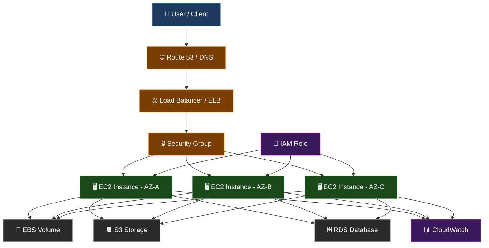

> 📸 `docs/images/architecture.png`

---

## 🖥️ EC2 Instance Types

📌 **Definition:** Instance types define the hardware profile of your virtual machine — CPU, RAM, network throughput, and storage IOPS.

💡 **Rule of thumb:** Match the instance family to the dominant resource your workload needs most.

---

### 📊 Instance Family Cheatsheet

| Family | Prefix | CPU:RAM Ratio | Real-World Use Cases |
|---|---|---|---|
| **General Purpose** | T, M, A | Balanced | Web servers, dev/test, small DBs, microservices |
| **Compute Optimized** | C | High CPU | Batch jobs, video encoding, ML inference, gaming servers |
| **Memory Optimized** | R, X, Z | High RAM | In-memory DBs (Redis, SAP HANA), real-time analytics |
| **Storage Optimized** | I, D, H | High IOPS | Data warehouses, Kafka, Elasticsearch, NoSQL |
| **Accelerated Computing** | P, G, F, Inf | GPU/FPGA | Deep learning training, 3D rendering, genomics |
| **HPC Optimized** | Hpc | Ultra-high perf | Computational fluid dynamics, weather simulation |

---

### 🔤 Reading an Instance Type Name

```
  c   7   g   n   .   48   x   l   a   r   g   e
  │   │   │   │       │
  │   │   │   │       └── Size: nano → micro → small → medium → large → xlarge → 48xlarge
  │   │   │   └────────── Network: n = high network bandwidth
  │   │   └────────────── Hardware: g = AWS Graviton (ARM), d = NVMe local disk
  │   └────────────────── Generation: 7 = 7th generation (newer = better perf/price)
  └────────────────────── Family: c = Compute Optimized
```

> 💡 **Pro tip:** Always prefer the **latest generation** (e.g., `m7g` over `m5`). Same price, 20–40% better performance.

---

### ⚙️ Instance Selection Workflow

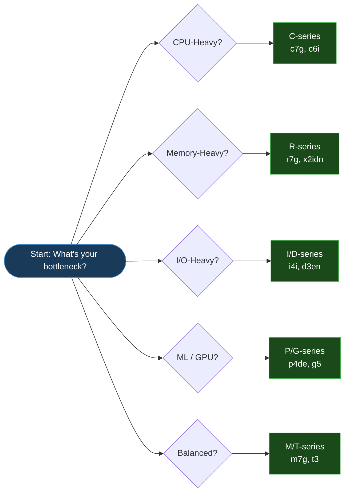

> 📸 `docs/images/instance-type-decision-tree.png`

---

## 💰 EC2 Pricing Models

📌 **Definition:** EC2 offers five pricing models — each optimized for a different workload pattern. Choosing the wrong one can cost you 3–10× more than necessary.

---

### 💡 Pricing Model Comparison

| Model | Discount vs On-Demand | Commitment | Interruption Risk | Best For |
|---|---|---|---|---|
| **On-Demand** | — Baseline | None | ❌ Never | Dev/test, unpredictable traffic, first-time setups |
| **Savings Plans** | Up to 66–72% | 1 or 3 years | ❌ Never | Flexible baseline workloads across families/regions |
| **Reserved Instances** | Up to 75% | 1 or 3 years | ❌ Never | Steady-state apps (databases, always-on services) |
| **Spot Instances** | Up to 90% | None | ✅ Yes (2-min notice) | Batch jobs, ML training, big data, fault-tolerant work |
| **Dedicated Hosts** | Fixed pricing | On-demand or reserved | ❌ Never | Compliance, BYOL licensing, regulatory requirements |

---

### 🔥 Spot Instance SRE Pattern — Handling Interruptions

> ⚠️ Spot instances **can be reclaimed by AWS** with a 2-minute warning. Design your application to survive this.

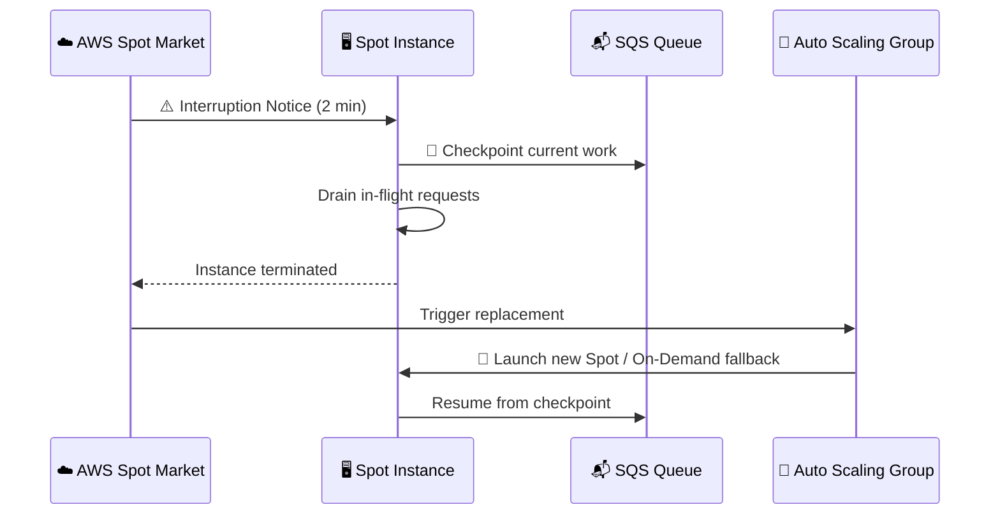

> 📸 `docs/images/spot-interruption-handling.png`

---

### 📐 Cost Optimization Decision Flow

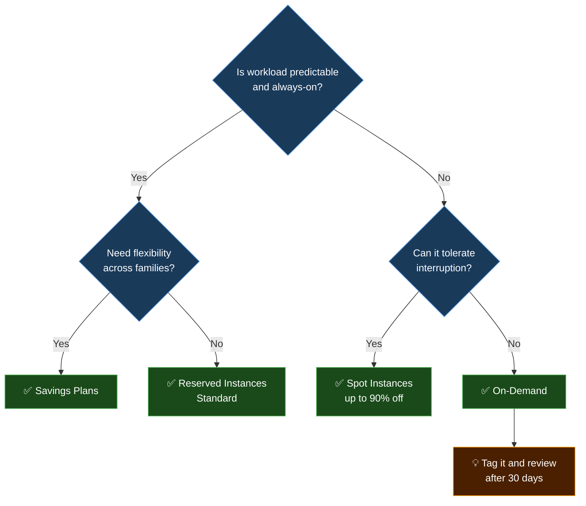

---

## 🚀 Launching Your First EC2 Instance

📌 **Definition:** Provisioning an EC2 instance means creating a virtual machine in a specific region, AZ, with a chosen OS, compute type, network config, and security settings.

### ⚙️ Step-by-Step Launch Workflow

```
Step 1 → Open EC2 Console → Click "Launch Instance"
Step 2 → Name your instance (e.g., "prod-web-01")
Step 3 → Select AMI (Amazon Linux 2023 recommended for production)
Step 4 → Choose Instance Type (e.g., t3.micro for dev / m7g.large for prod)
Step 5 → Create or select a Key Pair (.pem file — save it, you can't re-download!)
Step 6 → Configure Network (VPC, Subnet, Public IP)
Step 7 → Configure Security Group (allow port 22 for SSH, 80/443 for web)
Step 8 → Configure Storage (EBS volume — gp3 is default and most cost-efficient)
Step 9 → Add Tags (e.g., Name, Env, Team — critical for cost management)
Step 10 → Review → Launch
```

> 📸 `docs/images/ec2-launch-step1.png` — Launch wizard overview
> 📸 `docs/images/ec2-launch-step2.png` — AMI + instance type selection
> 📸 `docs/images/ec2-launch-step3.png` — Security group + storage config

---

### 🔌 Connecting After Launch (SSH)

```bash
# Step 1: Set correct permissions on your .pem file (REQUIRED on Linux/Mac)
chmod 400 mykeypair.pem

# Step 2: SSH into the instance
ssh -i "mykeypair.pem" ec2-user@<Public-IP-or-DNS>

# Amazon Linux 2 / AL2023 → user: ec2-user
# Ubuntu                  → user: ubuntu
# Debian                  → user: admin
# CentOS / RHEL           → user: ec2-user or centos
# Windows                 → use RDP on port 3389
```

> 💡 **Pro tip:** If you get `Permission denied (publickey)`, the most common causes are: wrong username for the AMI, wrong .pem file, or the Security Group doesn't allow your IP on port 22.

---

### 🔒 Security Group Best Practices

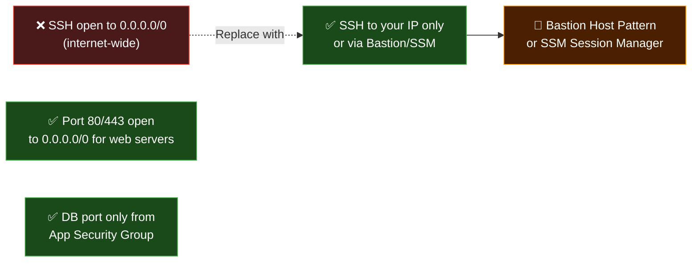

> 📸 `docs/images/security-group-config.png`

---

## 🔐 Key Pairs & Secure Access

📌 **Definition:** A Key Pair is an asymmetric cryptographic credential used to authenticate your SSH session to EC2 without a password. AWS stores the **public key** inside your instance; you hold the **private key** (.pem file).

---

### 🔑 How Key Pair Authentication Works

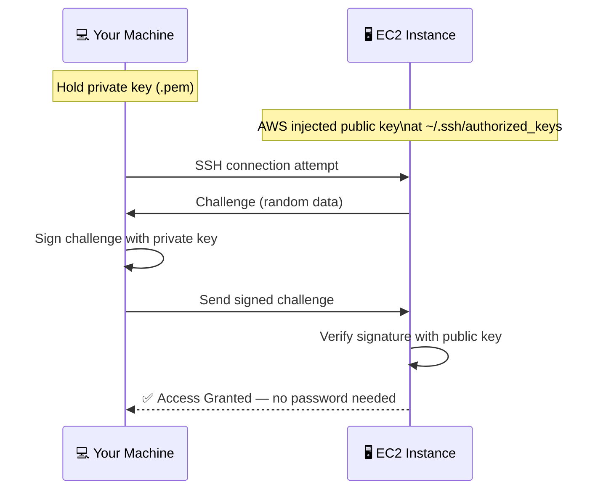

> 📸 `docs/images/keypair-auth-flow.png`

---

### 📋 Key Pair Types Comparison

| Type | Algorithm | Speed | Compatibility | Recommended? |
|---|---|---|---|---|
| **RSA** | RSA-2048/4096 | Moderate | Universal (SSH, PuTTY, WinSCP) | ✅ Beginners — widest support |
| **ED25519** | Elliptic Curve | Fast | Modern SSH clients only | ✅ Advanced — stronger security |

---

### 🔧 File Format Guide

| Format | Tool | Created By |
|---|---|---|
| `.pem` | Linux/Mac Terminal, Windows PowerShell, VS Code | AWS Console default |
| `.ppk` | PuTTY / WinSCP | Convert from .pem using PuTTYgen |

```bash
# Convert .pem → .ppk using puttygen (Windows)
puttygen mykey.pem -o mykey.ppk

# Or generate .ppk directly in AWS Console when creating the key pair
```

---

## 🛠️ EC2 Access Recovery Methods

> 🔥 **SRE Scenario:** You lost your .pem file. Your instance is running in production. How do you get back in?

Here are all four recovery methods, from easiest to most involved:

---

### 🟢 Method 1 — EC2 Instance Connect (Easiest)

**Works for:** Amazon Linux 2, Amazon Linux 2023, Ubuntu 20.04+

```
Console → EC2 → Instances → Select Instance → Connect → EC2 Instance Connect → Connect
```

You get a browser-based terminal. No key file needed.

> ⚠️ Requires the instance to have a **public IP** and Security Group allowing **port 22 from the EC2 Instance Connect IP range** for your region.

> 📸 `docs/images/ec2-instance-connect.png`

---

### 🟡 Method 2 — AWS Systems Manager (SSM) Session Manager

**Works for:** Any EC2 with SSM Agent + IAM Role (no open ports required)

**Prerequisites:**
- SSM Agent installed (pre-installed on Amazon Linux 2+)
- IAM Role attached: `AmazonSSMManagedInstanceCore`
- VPC endpoint OR internet access for SSM

```
Console → EC2 → Instances → Connect → Session Manager → Connect
```

> 💡 **Production best practice:** This is the recommended method. It requires **zero open SSH ports** and provides full audit logging via CloudTrail.

> 📸 `docs/images/ssm-session-manager.png`

---

### 🔴 Method 3 — Volume Swap (Manual Root Key Injection)

**Works for:** Any Linux EC2, any situation

```bash
# Step 1: Stop the locked-out instance (NOT terminate)
# Step 2: Detach its root EBS volume
# Step 3: Attach it to a "helper" EC2 instance as /dev/sdf
# Step 4: SSH into the helper instance

# Step 5: Mount the rescued volume
sudo mkdir /mnt/rescue
sudo mount /dev/xvdf1 /mnt/rescue

# Step 6: Replace the authorized_keys with your new public key
sudo bash -c 'echo "ssh-rsa AAAA... your-new-public-key" > /mnt/rescue/home/ec2-user/.ssh/authorized_keys'
sudo chown 1000:1000 /mnt/rescue/home/ec2-user/.ssh/authorized_keys
sudo chmod 600 /mnt/rescue/home/ec2-user/.ssh/authorized_keys

# Step 7: Unmount and detach
sudo umount /mnt/rescue

# Step 8: Re-attach volume to original instance as /dev/xvda (root)
# Step 9: Start original instance → SSH with new .pem file
```

> 📸 `docs/images/volume-recovery-steps.png`

---

### 🟠 Method 4 — AMI Rebuild (Fastest for stateless instances)

**Works for:** Instances without critical local data

```
Step 1 → Stop the instance
Step 2 → Actions → Image and Templates → Create Image
Step 3 → Launch new instance from that AMI
Step 4 → Attach a NEW key pair during launch
Step 5 → SSH into new instance with new .pem
```

> 📸 `docs/images/ami-rebuild-recovery.png`

---

### 🔎 Recovery Decision Matrix

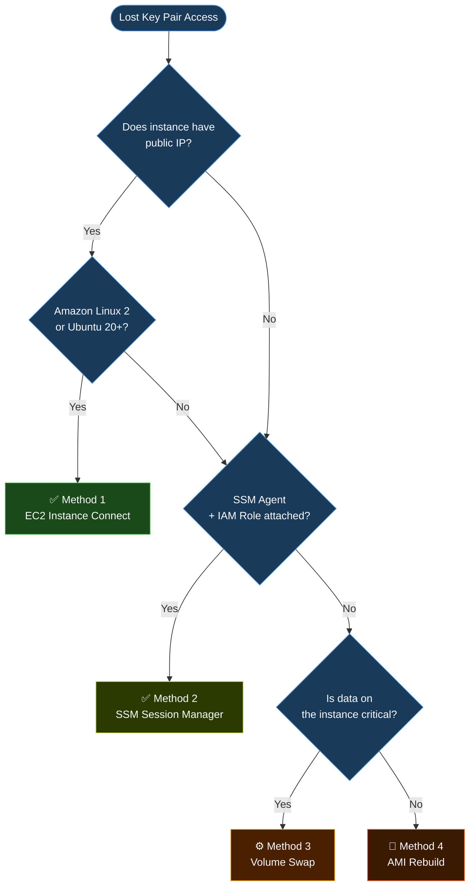

---

## 🖼️ AMI – Amazon Machine Image

📌 **Definition:** An AMI is a **golden template** for your EC2 instances. It captures the OS, installed software, configurations, and data volumes — so you can launch identical instances on demand.

💡 **Real-world usage:** Think of an AMI like a VM snapshot, Docker image, or a pre-baked server image. In CI/CD pipelines, teams build a "Golden AMI" with all dependencies pre-installed, then launch Auto Scaling Groups from it. This makes scaling 10× faster than bootstrapping from scratch.

---

### 🧱 What an AMI Contains

```
┌─────────────────────────────────────────────┐
│              AMI Package                    │
│                                             │
│  ┌─────────────┐  ┌─────────────────────┐  │
│  │ Root Volume │  │ Additional Volumes  │  │
│  │  (OS + App) │  │  (Data, Logs, etc.) │  │
│  └─────────────┘  └─────────────────────┘  │
│                                             │
│  ┌──────────────────────────────────────┐  │
│  │  Launch Permissions (public/private) │  │
│  │  Block Device Mappings               │  │
│  │  Architecture (x86 / ARM Graviton)   │  │
│  │  Virtualization Type (HVM)           │  │
│  └──────────────────────────────────────┘  │
└─────────────────────────────────────────────┘
```

---

### 🗂️ AMI Types

| Type | Managed By | Use Case |
|---|---|---|
| **AWS-provided** | Amazon | Standard OS images (Amazon Linux 2023, Ubuntu, Windows Server) |
| **Marketplace AMIs** | Third-party vendors | WordPress, Splunk, hardened RHEL, pre-licensed SQL Server |
| **Custom / Golden AMI** | Your team | Baked with your app, agents, and config — fastest scaling |
| **Community AMIs** | Public contributors | Shared images (use with caution — always review source) |

---

### ⚙️ Creating a Golden AMI (Step-by-Step)

```
Step 1 → Launch a base EC2 instance (e.g., Amazon Linux 2023)
Step 2 → SSH in and install everything your app needs:
          - Runtime (Node, Python, Java)
          - Web server (Nginx, Apache)
          - Monitoring agent (CloudWatch, Datadog)
          - Security agent (Inspector, CrowdStrike)
Step 3 → Test the configuration thoroughly
Step 4 → Clean up: remove temp files, clear logs, clear bash history
Step 5 → Console → EC2 → Instances → Select Instance
Step 6 → Actions → Image and Templates → Create Image
Step 7 → Set image name (e.g., "myapp-golden-v1.2-2026-04-07")
Step 8 → Configure volume settings → Create Image
Step 9 → AWS snapshots volumes and registers the AMI
Step 10 → Use this AMI in Launch Templates for Auto Scaling Groups
```

> 📸 `docs/images/ami-create-step1.png` — Actions → Create Image menu
> 📸 `docs/images/ami-create-step2.png` — Image name + storage config dialog

---

### 🔄 AMI Lifecycle Flow

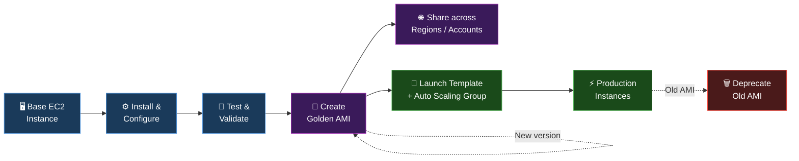

> 📸 `docs/images/ami-lifecycle.png`

---

### 🌍 Cross-Region AMI Copy

```bash
# Copy AMI from us-east-1 to eu-west-1
aws ec2 copy-image \
  --source-region us-east-1 \
  --source-image-id ami-0abcdef1234567890 \
  --region eu-west-1 \
  --name "myapp-golden-v1.2-eu"
```

> 💡 **SRE practice:** Always maintain identical Golden AMIs across all regions you operate in. This enables DR failover without manual rebuilds.

---

## 📦 Placement Groups

📌 **Definition:** Placement Groups control the **physical placement** of EC2 instances within AWS infrastructure — letting you optimize for ultra-low latency, high availability, or fault isolation.

---

### 🗺️ Three Placement Strategies — Visual Comparison

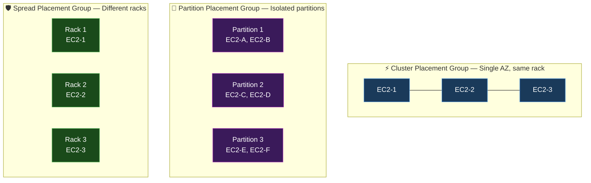

> 📸 `docs/images/placement-group-diagram.png`

---

### 📋 When to Use Each Strategy

| Strategy | Latency | Fault Isolation | Instance Limit | Best For |
|---|---|---|---|---|
| **Cluster** | Sub-millisecond | ❌ Same rack | Unlimited | HPC, ML training, big data (Spark/Hadoop), financial modeling |
| **Partition** | Low | ✅ Partition-level | 7 partitions/AZ | Kafka, Cassandra, HDFS, distributed systems |
| **Spread** | Normal | ✅ Rack-level | 7 instances/AZ | Critical primary nodes, master nodes, control planes |

---

### ⚙️ Create a Placement Group (CLI)

```bash
# Create a cluster placement group
aws ec2 create-placement-group \
  --group-name "hpc-cluster-pg" \
  --strategy cluster

# Create a spread placement group
aws ec2 create-placement-group \
  --group-name "critical-nodes-pg" \
  --strategy spread

# Launch into a placement group
aws ec2 run-instances \
  --image-id ami-0abcdef1234567890 \
  --instance-type c7g.8xlarge \
  --placement "GroupName=hpc-cluster-pg" \
  --count 4
```

---

## ⚡ User Data – Bootstrap Automation

📌 **Definition:** User Data is a shell script (or cloud-init config) you attach to an EC2 instance at launch. It runs **automatically on first boot** to install software, configure services, and bootstrap your application — no manual SSH required.

💡 **Real-world pattern:** In production, User Data is the bridge between "bare OS" and "running application." Every Auto Scaling Group instance uses it to become production-ready within seconds of launching.

---

### ⚙️ How User Data Works Internally

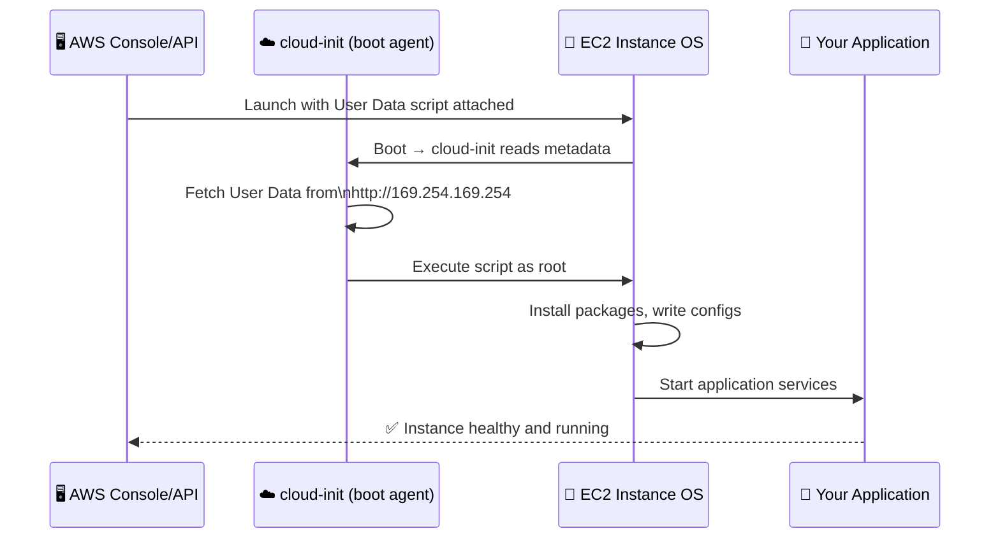

> 📸 `docs/images/userdata-console-step1.png` — Advanced Details → User Data field

---

### 🧪 Practical Example — Apache Web Server Bootstrap

```bash
#!/bin/bash
# ─────────────────────────────────────────────────
# Production-Grade User Data Script
# Amazon Linux 2023 / Amazon Linux 2
# ─────────────────────────────────────────────────

# Update OS packages
yum update -y

# Install Apache web server
yum install -y httpd

# Write application page
cat <<EOF > /var/www/html/index.html
<!DOCTYPE html>
<html>
<body>
  <h1>🚀 EC2 Instance Ready!</h1>
  <p>Hostname: $(hostname)</p>
  <p>Instance ID: $(curl -s http://169.254.169.254/latest/meta-data/instance-id)</p>
</body>
</html>
EOF

# Enable and start Apache (persists across reboots)
systemctl enable httpd
systemctl start httpd

# Install CloudWatch agent for monitoring (production must-have)
yum install -y amazon-cloudwatch-agent
/opt/aws/amazon-cloudwatch-agent/bin/amazon-cloudwatch-agent-ctl \
  -a fetch-config -m ec2 -s -c default
```

**Verify it worked:**
```bash
# In browser:
http://<Public-IP>

# Or from another terminal:
curl http://<Public-IP>
```

---

### 🔁 Modifying User Data After Launch

> By default, User Data **only runs once** (at first boot). Here's when and how to re-run it.

**Steps to modify User Data on a running instance:**

```
Step 1 → Stop the instance (NOT terminate)
Step 2 → Console → Actions → Instance Settings → Edit User Data
Step 3 → Update your script
Step 4 → Start the instance
```

**Force re-run on reboot:**

```bash
# This tells cloud-init to re-run scripts on every boot
sudo cloud-init clean --logs
sudo reboot
```

---

### ✅ Real-World Scenarios for Updating User Data

| Scenario | Why Update User Data |
|---|---|
| **Forgot to install a package** | Add `yum install -y <package>` and re-run |
| **New app version to deploy** | Update script to pull new artifact |
| **Add CloudWatch/Datadog agent** | Add agent install commands + config |
| **Update launch behavior for ASG** | New instances will pick up updated script |
| **Golden AMI baking** | Run updated script → snapshot → new AMI |
| **cloud-init failure** | Fix script → re-run after reboot |

---

## 🔎 EC2 Instance Metadata

📌 **Definition:** EC2 Instance Metadata is a **link-local HTTP API** (`169.254.169.254`) available inside every EC2 instance that exposes real-time information about the instance itself — its ID, type, IP, IAM role, and more.

💡 **Use case:** Your application code can call this endpoint to discover its own environment — no hardcoded IDs, no config files, no secrets passed in.

---

### 🌐 Metadata URL Structure (IMDSv2 — Required in Production)

> ⚠️ **Security note:** Always use **IMDSv2** (token-based). IMDSv1 is vulnerable to SSRF attacks. IMDSv2 requires a session token and is the AWS-recommended standard.

```bash
# ─────────────────────────────────────────────────
# IMDSv2 — Production-Safe Metadata Access
# ─────────────────────────────────────────────────

# Step 1: Get a session token (TTL = 21600 seconds = 6 hours)
TOKEN=$(curl -s -X PUT "http://169.254.169.254/latest/api/token" \
  -H "X-aws-ec2-metadata-token-ttl-seconds: 21600")

# Step 2: Use token in all metadata calls
curl -s -H "X-aws-ec2-metadata-token: $TOKEN" \
  http://169.254.169.254/latest/meta-data/

# ─────────────────────────────────────────────────
# Useful Metadata Endpoints
# ─────────────────────────────────────────────────

# Instance ID
curl -s -H "X-aws-ec2-metadata-token: $TOKEN" \
  http://169.254.169.254/latest/meta-data/instance-id

# Instance Type
curl -s -H "X-aws-ec2-metadata-token: $TOKEN" \
  http://169.254.169.254/latest/meta-data/instance-type

# Public IPv4
curl -s -H "X-aws-ec2-metadata-token: $TOKEN" \
  http://169.254.169.254/latest/meta-data/public-ipv4

# Private IPv4
curl -s -H "X-aws-ec2-metadata-token: $TOKEN" \
  http://169.254.169.254/latest/meta-data/local-ipv4

# Availability Zone
curl -s -H "X-aws-ec2-metadata-token: $TOKEN" \
  http://169.254.169.254/latest/meta-data/placement/availability-zone

# IAM Role credentials (temporary STS tokens)
curl -s -H "X-aws-ec2-metadata-token: $TOKEN" \
  http://169.254.169.254/latest/meta-data/iam/security-credentials/<role-name>

# AMI ID
curl -s -H "X-aws-ec2-metadata-token: $TOKEN" \
  http://169.254.169.254/latest/meta-data/ami-id

# Security groups
curl -s -H "X-aws-ec2-metadata-token: $TOKEN" \
  http://169.254.169.254/latest/meta-data/security-groups
```

> 📸 `docs/images/metadata-curl-output.png` — Terminal showing metadata responses

---

### 📊 Metadata vs. User Data vs. Tags — What's the Difference?

| | Metadata | User Data | Tags |
|---|---|---|---|
| **What it is** | Live instance info | Your boot script | Key-value labels |
| **URL** | `169.254.169.254/meta-data/` | `169.254.169.254/user-data` | Via AWS API / Console |
| **Changes** | Dynamic (IP, state) | Static after launch* | Editable any time |
| **Use in code** | Discover instance details | Bootstrap only | Cost allocation, filtering |

---

## 🧩 Multi-Layer System Design

> This section shows how EC2 fits into a production-grade, multi-tier architecture — the way real systems are built.

---

### 🔷 High-Level View — 3-Tier Web Application

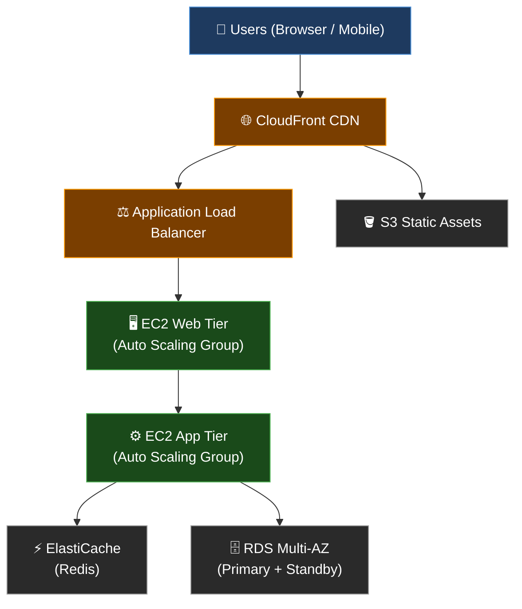

---

### 🔷 Mid-Level View — Auto Scaling + Health Checks

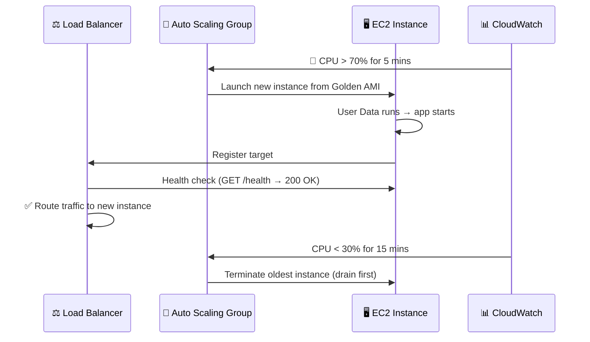

---

### 🔷 Deep-Level View — Failure Recovery (SRE Mindset)

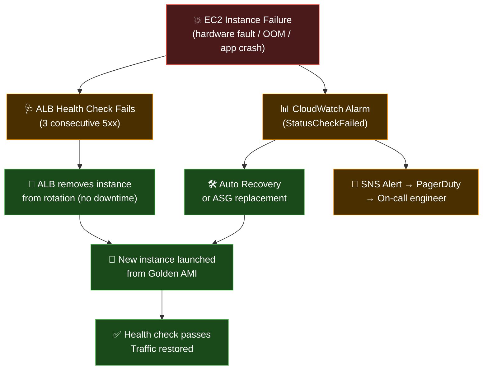

> 📸 `docs/images/failure-recovery-flow.png`

---

## 📐 Architecture Diagrams

### 🔄 End-to-End Request Lifecycle

```mermaid
sequenceDiagram
    participant U as 👤 User
    participant DNS as 🌐 Route 53
    participant CF as 🌍 CloudFront
    participant ALB as ⚖️ ELB/ALB
    participant SG as 🔒 Security Group
    participant EC2 as 🖥️ EC2 Instance
    participant Cache as ⚡ ElastiCache
    participant DB as 🗄️ RDS

    U->>DNS: Resolve api.myapp.com
    DNS-->>U: ALB IP (latency-based routing)
    U->>CF: HTTPS request
    CF->>ALB: Forward (cache miss)
    ALB->>SG: Evaluate inbound rules
    SG->>EC2: Allow (port 8080 from ALB SG)
    EC2->>Cache: GET user:12345 (Redis)
    alt Cache Hit
        Cache-->>EC2: ✅ Return cached data
    else Cache Miss
        EC2->>DB: SELECT * FROM users WHERE id=12345
        DB-->>EC2: Return data
        EC2->>Cache: SET user:12345 (TTL=300s)
    end
    EC2-->>ALB: HTTP 200 + JSON response
    ALB-->>CF: Forward response
    CF-->>U: Serve response (+ cache for static)
```

> 

---

## ⚙️ Configuration Reference

| Parameter | Example Value | Description |
|---|---|---|
| `AMI_ID` | `ami-0abcdef1234567890` | Base image for your EC2 instance |
| `INSTANCE_TYPE` | `t3.micro` / `m7g.large` | Hardware profile (CPU + RAM) |
| `KEY_NAME` | `my-prod-keypair` | SSH key pair name in AWS |
| `SECURITY_GROUP_ID` | `sg-0123456789abcdef0` | Firewall rules for instance |
| `SUBNET_ID` | `subnet-0123456789abcdef0` | VPC subnet (private recommended) |
| `IAM_INSTANCE_PROFILE` | `EC2-SSM-CloudWatch-Role` | IAM role attached to instance |
| `USER_DATA_FILE` | `userdata/bootstrap.sh` | Bootstrap script path |
| `EBS_VOLUME_TYPE` | `gp3` | Storage type (gp3 = best default) |
| `EBS_SIZE_GB` | `20` | Root volume size in GB |
| `PLACEMENT_GROUP` | `hpc-cluster-pg` | Placement group name (optional) |
| `METADATA_OPTIONS` | `IMDSv2 required` | Always enforce IMDSv2 |

---

### 🧱 Infrastructure as Code (Terraform Snippet)

```hcl
# Production EC2 instance with best practices
resource "aws_instance" "app_server" {
  ami                    = var.golden_ami_id
  instance_type          = var.instance_type       # e.g. m7g.large
  key_name               = var.key_pair_name
  subnet_id              = var.private_subnet_id   # Always private for app tier
  vpc_security_group_ids = [aws_security_group.app_sg.id]
  iam_instance_profile   = aws_iam_instance_profile.ec2_profile.name

  # Enforce IMDSv2 — required for security compliance
  metadata_options {
    http_endpoint               = "enabled"
    http_tokens                 = "required"   # IMDSv2 = token required
    http_put_response_hop_limit = 1
  }

  # gp3 is more cost-effective than gp2 (same IOPS, lower price)
  root_block_device {
    volume_type           = "gp3"
    volume_size           = 20
    encrypted             = true
    delete_on_termination = true
  }

  user_data = file("${path.module}/userdata/bootstrap.sh")

  tags = {
    Name        = "prod-app-server"
    Environment = "production"
    Team        = "platform"
    ManagedBy   = "terraform"
  }
}
```

---

## 🔐 Security Best Practices Checklist

| # | Practice | Priority |
|---|---|---|
| ✅ | Use IAM Roles (not access keys) on EC2 | 🔴 Critical |
| ✅ | Enable IMDSv2 — disable IMDSv1 | 🔴 Critical |
| ✅ | No SSH (port 22) open to 0.0.0.0/0 | 🔴 Critical |
| ✅ | Use SSM Session Manager instead of bastion/SSH | 🔴 Critical |
| ✅ | Enable EBS encryption at rest | 🟠 High |
| ✅ | Use private subnets for app/db tiers | 🟠 High |
| ✅ | Enable CloudTrail for all API calls | 🟠 High |
| ✅ | Run Amazon Inspector for CVE scanning | 🟡 Medium |
| ✅ | Use AWS Config rules to detect drift | 🟡 Medium |
| ✅ | Tag all resources for cost + compliance | 🟢 Standard |

---

## 🎥 Animation Library

| Animation | Path | Description |
|---|---|---|
| Request Flow | `assets/animations/request_flow.gif` | End-to-end user request through ALB → EC2 → DB |
| System Interaction | `assets/animations/system_interaction.mp4` | EC2 ↔ S3 ↔ RDS ↔ ElastiCache service mesh |
| Failure Recovery | `assets/animations/failure_recovery.gif` | ASG auto-replacement on instance failure |
| Scaling Behavior | `assets/animations/scaling_behavior.gif` | Horizontal scale-out under CPU spike |

---

## 🧰 Interactive Tools

| Tool | Purpose | Link |
|---|---|---|
| Lucidchart | Interactive architecture diagrams | [lucidchart.com](https://lucidchart.com) |
| Miro | Collaborative system design whiteboard | [miro.com](https://miro.com) |
| Figma | Visual system design & mockups | [figma.com](https://figma.com) |
| Whimsical | Flow diagrams and wireframes | [whimsical.com](https://whimsical.com) |
| draw.io | Free, open-source diagrams | [draw.io](https://draw.io) |

---

## 🤝 Contributing

```bash
# Fork the repository
git clone https://github.com/your-username/cloud-devops-mastery.git

# Create a feature branch
git checkout -b feature/ec2-advanced-networking

# Make your changes, then push
git push origin feature/ec2-advanced-networking

# Open a Pull Request → describe what you changed and why
```

> 📌 Please follow the existing section format: Definition → Real-World Explanation → Step-by-Step → Diagram → Screenshot placeholders.

---

## 📜 License

This project is licensed under the **MIT License** — free to use, share, and build upon.

---

<div align="center">

## ❤️ Found This Useful?

**⭐ Star this repo** to bookmark it for future reference
**🍴 Fork it** to build your own cloud learning library
**📢 Share it** with your team, bootcamp, or community

---

*Built by teja , for engineers — with ☁️ and ❤️*

*"The best way to learn cloud is to design it, break it, and rebuild it better."*

</div>
